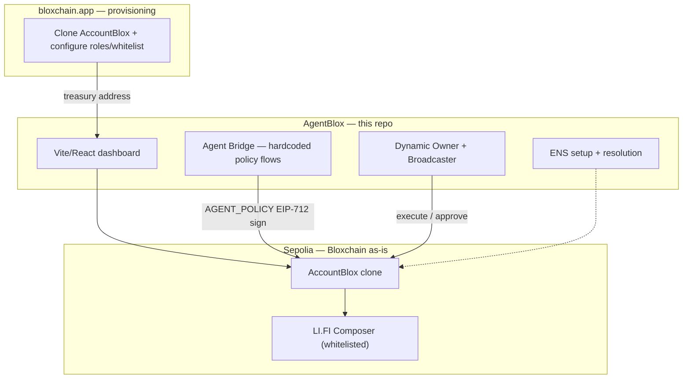

# AgentBlox

**Treasury workspace where finance teams and policy agents operate under the same on-chain rules.**

AgentBlox is the ETHGlobal New York 2026 hackathon application built by [Particle CS](https://particlecs.com) to showcase the [Bloxchain Protocol](https://github.com/PracticalParticle/Bloxchain-Protocol) and **AccountBlox pattern as deployed infrastructure** — without modifying `contracts/core/`.

| Layer | Product | Role |
|-------|---------|------|
| **Protocol** | [Bloxchain Protocol](https://github.com/PracticalParticle/Bloxchain-Protocol) | On-chain policy engine (timelock, RBAC, GuardController whitelists) |
| **Provisioning** | [bloxchain.app](https://bloxchain.app/) | Create and configure AccountBlox clones (roles, whitelist, timelock) |
| **Operations** | **AgentBlox** (this repo) | Run treasuries — approvals, ENS identity, LI.FI execution, agent flows |

**One-line pitch:**  
*AgentBlox is a treasury workspace where AI agents and finance teams share the same AccountBlox policy engine — propose, review, approve, execute — with whitelisted on-chain actions only.*

**Sponsor positioning:**  
*Dynamic holds the keys, LI.FI runs the flows, ENS names the actors — Bloxchain decides what anyone is allowed to trigger.*

---

## Event & sponsors

- **Event:** [ETHGlobal New York 2026](https://ethglobal.com/events/newyork2026)
- **Prizes:** [ethglobal.com/events/newyork2026/prizes](https://ethglobal.com/events/newyork2026/prizes)
- **Constraint:** Maximum **3 sponsor integrations**

| Slot | Sponsor | Role in AgentBlox |
|------|---------|-------------------|
| 1 | [Dynamic](https://www.dynamic.xyz/) | Owner (embedded wallet), Broadcaster (server wallet) |
| 2 | [LI.FI Composer](https://docs.li.fi/composer/overview) | Whitelisted atomic execution flows |
| 3 | [ENS](https://ens.domains/) | Treasury/agent naming + policy text records |

---

## The problem

Treasuries and automated agents both need to move funds. Existing stacks solve **key custody** (Dynamic, Privy, Ledger) but not **policy** — what actions are constitutionally allowed. A compromised agent or rushed approval can drain funds in a single transaction.

## The solution

Each treasury is an **AccountBlox clone** on Sepolia. Bloxchain enforces:

1. **Two-party authorization** — meta-tx (signer ≠ executor) or timelock (request → wait → approve)
2. **GuardController whitelists** — only pre-approved contracts (e.g. LI.FI Composer) can be called
3. **RBAC** — scoped roles (`AGENT_POLICY` signs only; `ANALYST` requests only)
4. **Audit trail** — every operation is a `TxRecord` with explicit status history

---

## Dual demo lanes (one product)

| Lane | Persona | Bloxchain pattern | Sponsors |
|------|---------|-------------------|----------|
| **A — Agentic** | Policy agent | Meta-tx + GuardController whitelist | Dynamic + LI.FI |
| **B — Fintech** | Analyst / CFO | Timelock + audit trail | Dynamic + ENS |

### Lane A — Agentic workflow

1. Agent Bridge computes rebalance (deterministic rules, no LLM for demo).
2. `AGENT_POLICY` role signs EIP-712 meta-tx off-chain.
3. Dynamic server wallet (Broadcaster) submits execution.
4. GuardController checks whitelist → LI.FI Composer flow runs.
5. **Attack demo:** unauthorized transfer → `TargetNotWhitelisted` revert in UI.

### Lane B — Institutional workflow

1. Analyst requests vendor payment (USDC on Sepolia) → `TxRecord` enters `PENDING`.
2. Timelock countdown in dashboard.
3. Owner (CFO) approves via Dynamic embedded wallet.
4. Payment executes; full audit trail visible.
5. ENS `treasury.acme.eth` resolves to the AccountBlox clone.

---

## Architecture



### Responsibility split

| Feature | bloxchain.app | AgentBlox |
|---------|---------------|-----------|
| Clone AccountBlox | Yes | Import address |
| RBAC + whitelist config | Yes | Read on-chain state |
| ENS | No | **Full integration** |
| Dynamic wallets | No | **Full integration** |
| LI.FI execution | No | **Full integration** |
| Agent proposals | No | **Agent Bridge** |
| Approval dashboard | No | **Yes** |

### Agent approach

- **Hackathon:** Deterministic hardcoded flows (no LLM) for reliable demos.
- **Future:** Same Agent Bridge API exposed via MCP for Hermes/OpenClaw.
- **Security:** Agent proposes and signs only; Broadcaster executes; Bloxchain enforces.

---

## Tech stack

| Layer | Technology |
|-------|------------|
| Frontend | Vite 5, React 18, TypeScript |
| Wallet / auth | [Dynamic React SDK](https://www.dynamic.xyz/docs/react/reference/quickstart) |
| On-chain | [Bloxchain SDK](https://www.npmjs.com/package/@bloxchain/sdk) + [viem](https://viem.sh/) |
| Execution | [LI.FI SDK](https://docs.li.fi/composer/guides/sdk-integration) |
| Identity | ENS via viem (`getEnsAddress`, `getEnsText`) |
| Agent Bridge | Node HTTP server (`server/index.ts`) |

> **Vite 5 required:** Dynamic SDK is incompatible with Vite 8. Use `vite@5` explicitly.

---

## Project structure

```
AgentBlox/
├── docs/                    # Implementation plan (start here)
├── public/
├── server/                  # Agent Bridge API (policy + signing)
│   └── index.ts
├── src/
│   ├── lib/                 # config, ENS, agent API client
│   ├── pages/               # Dashboard, Treasury, Agent Flows
│   ├── App.tsx
│   └── main.tsx
├── .env.example
├── package.json
├── vite.config.ts
└── README.md
```

---

## Getting started

### Prerequisites

- Node.js **18.20.5+**
- Dynamic environment ID — [Dynamic Dashboard](https://app.dynamic.xyz/dashboard/developer/api)
- AccountBlox clone on Sepolia — provision via [bloxchain.app](https://bloxchain.app/) or `create-wallet-copyblox.js` in Bloxchain Protocol repo

### Install

```bash
git clone <this-repo>
cd AgentBlox
npm install
cp .env.example .env
# Fill in VITE_DYNAMIC_ENVIRONMENT_ID and treasury address
```

### Dynamic dashboard checklist

Before running locally, configure in [Dynamic Dashboard](https://app.dynamic.xyz/):

1. **Chains:** Enable Sepolia under Chains & Networks
2. **Sign-in:** Enable your auth method (email OTP recommended for demo)
3. **Embedded wallets:** Enable under Wallets (for Owner role)
4. **CORS:** Add `http://localhost:5173` to Allowed Origins

### Run

```bash
# Frontend only
npm run dev

# Agent Bridge server only
npm run dev:server

# Both (recommended for full demo)
npm run dev:all
```

Open [http://localhost:5173](http://localhost:5173).

### Build

```bash
npm run typecheck
npm run build
```

---

## Documentation

Implementation guides live in [`docs/`](./docs/):

| Doc | Description |
|-----|-------------|
| [docs/index.md](./docs/index.md) | Documentation index |
| [docs/architecture.md](./docs/architecture.md) | System architecture |
| [docs/implementation-plan.md](./docs/implementation-plan.md) | Phased build plan |
| [docs/bloxchain-integration.md](./docs/bloxchain-integration.md) | AccountBlox + SDK |
| [docs/dynamic-integration.md](./docs/dynamic-integration.md) | Owner + Broadcaster |
| [docs/lifi-integration.md](./docs/lifi-integration.md) | Composer + whitelist |
| [docs/ens-integration.md](./docs/ens-integration.md) | Naming + text records |
| [docs/agent-bridge.md](./docs/agent-bridge.md) | Deterministic agent flows |
| [docs/demo-script.md](./docs/demo-script.md) | 3-minute demo script |

---

## Bloxchain infrastructure (use as-is)

| Contract | Sepolia address |
|----------|-----------------|
| EngineBlox | `0x726d78c9683a96d66196d2b8350923e8ca0d8597` |
| AccountBlox | `0x783eb64d7d5de55f6913f9cb42ef5a4c402884c0` |
| CopyBlox | `0x928a2bd6c13e4f48a0850d2171a8d79b29959fc7` |

Packages: `@bloxchain/sdk` · Protocol repo: [Bloxchain-Protocol](https://github.com/PracticalParticle/Bloxchain-Protocol)

**No changes to `contracts/core/` during the hackathon.**

---

## Prize targets

| Track | Sponsor |
|-------|---------|
| Agentic Workflows | LI.FI ($4,000) |
| Best ENS Integration for AI Agents | ENS ($2,500 1st) |
| Best Agentic Build | Dynamic ($2,000) |
| Best Money App | Dynamic ($2,000) |

**ENS booth presentation required Sunday morning** for ENS prizes.

---

## What AgentBlox is not

- Not a fork or upgrade of Bloxchain core
- Not a generic LLM chatbot (deterministic flows for demo; agent-ready API for later)
- Not competing with Dynamic on custody — complementary policy middleware
- Not rebuilding bloxchain.app provisioning UI

---

## License

Hackathon application code: see repository license.  
Bloxchain Protocol: [MPL-2.0](https://github.com/PracticalParticle/Bloxchain-Protocol).

**Security contact:** security@particlecs.com

---

*Built by Particle CS for ETHGlobal New York 2026 · Powered by [Bloxchain Protocol](https://bloxchain.app/)*
