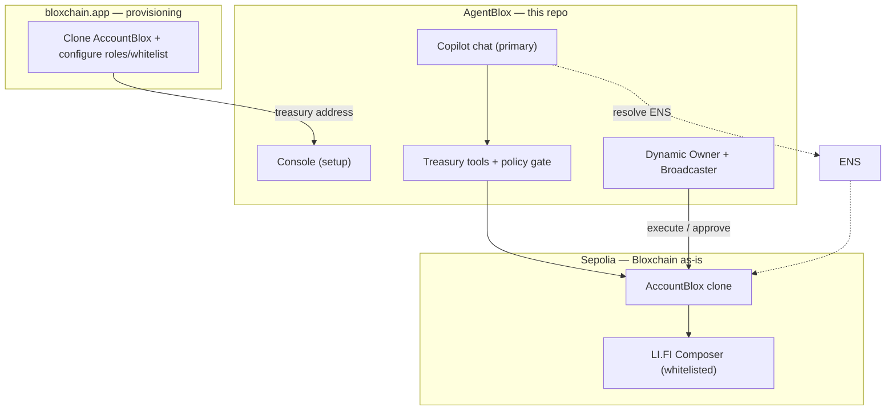

# AgentBlox

**Treasury workspace where finance teams and policy agents operate under the same on-chain rules.**

AgentBlox is the ETHGlobal New York 2026 hackathon application built by [Particle CS](https://particlecs.com) to showcase the [Bloxchain Protocol](https://github.com/PracticalParticle/Bloxchain-Protocol) and **AccountBlox pattern as deployed infrastructure** — without modifying `contracts/core/`.

| Layer | Product | Role |
|-------|---------|------|
| **Protocol** | [Bloxchain Protocol](https://github.com/PracticalParticle/Bloxchain-Protocol) | On-chain policy engine (timelock, RBAC, GuardController whitelists) |
| **Provisioning** | [bloxchain.app](https://bloxchain.app/) | Create and configure AccountBlox clones (roles, whitelist, timelock) |
| **Operations** | **AgentBlox** (this repo) | **Copilot** for day-to-day ops · **Console** for setup |

**One-line pitch:**  
*AgentBlox is a conversational treasury platform — ask your Copilot to read balances, propose rebalances, or request payments, while Bloxchain AccountBlox constitutionally limits what can execute.*

**Sponsor positioning:**  
*Dynamic holds the keys, LI.FI runs the flows, ENS names the actors — Bloxchain decides what anyone is allowed to trigger.*

---

## Event & sponsors

- **Event:** [ETHGlobal New York 2026](https://ethglobal.com/events/newyork2026)
- **Constraint:** Maximum **3 sponsor integrations**

| Slot | Sponsor | Role in AgentBlox |
|------|---------|-------------------|
| 1 | [Dynamic](https://www.dynamic.xyz/) | Owner (embedded wallet), Broadcaster (server wallet) |
| 2 | [LI.FI Composer](https://docs.li.fi/composer/overview) | Whitelisted atomic execution flows |
| 3 | [ENS](https://ens.domains/) | Treasury/agent naming + policy text records |

---

## The problem

Treasuries and automated agents both need to move funds. Existing stacks solve **key custody** (Dynamic, Privy, Ledger) but not **policy** — what actions are constitutionally allowed. A compromised agent or rushed approval can drain funds in a single transaction.

## The solution

Each treasury is an **AccountBlox clone** on Sepolia. Bloxchain enforces:

1. **Two-party authorization** — meta-tx (signer ≠ executor) or timelock (request → wait → approve)
2. **GuardController whitelists** — only pre-approved contracts (e.g. LI.FI Composer) can be called
3. **RBAC** — scoped roles (`AGENT_POLICY` signs only; `ANALYST` requests only)
4. **Audit trail** — every operation is a `TxRecord` with explicit status history

---

## Two surfaces

| Surface | Route | Purpose |
|---------|-------|---------|
| **Copilot** | `/` | Primary — chat with treasury tools (LLM or slash commands) |
| **Console** | `/console` | Setup — import treasury, roles, env checklist |

Day-to-day treasury operations happen in **Copilot**. Configuration happens in **Console** or on [bloxchain.app](https://bloxchain.app/).

---

## Treasury operations (via Copilot tools)

One AccountBlox clone, two authorization paths. See [docs/treasury-lifecycle.md](./docs/treasury-lifecycle.md).

| Operation | Auth path | Copilot command |
|-----------|-----------|-----------------|
| **Treasury rebalance** | Policy execution (meta-tx) | `/rebalance` |
| **Vendor payment** | Timelock | `/pay` |
| **Policy validation** | Blocked target | `/attack` |
| **Monitor / identity** | Read-only | `/status`, `/ens`, `/pending`, `/whitelist` |

### Policy execution (e.g. rebalance)

1. `propose_rebalance` → policy gate validates flow ID
2. `AGENT_POLICY` signs EIP-712 meta-tx (Phase 3)
3. Dynamic Broadcaster executes → LI.FI Composer runs

### Timelock disbursement (e.g. vendor payment)

1. `request_vendor_payment` → `PENDING` TxRecord
2. Owner approves via Dynamic (Phase 5)
3. Full audit trail via `/pending`

---

## Architecture



### Responsibility split

| Feature | bloxchain.app | AgentBlox |
|---------|---------------|-----------|
| Clone AccountBlox | Yes | Import address |
| RBAC + whitelist config | Yes | Read on-chain state |
| ENS | No | **Full integration** |
| Dynamic wallets | No | **Full integration** |
| LI.FI execution | No | **Full integration** |
| Agent proposals | No | **Copilot treasury tools** |
| Approval UI | No | **Copilot tool cards** (Phase 3+) |

### Agent approach

- **Hackathon:** Deterministic treasury tools + slash commands; optional LLM via Vercel AI SDK.
- **Future:** Export same tools as MCP for Hermes/OpenClaw.
- **Security:** AGENT_POLICY signs only; Broadcaster executes; Bloxchain enforces.

---

## Tech stack

| Layer | Technology |
|-------|------------|
| Frontend | Vite 5, React 18, TypeScript, `@ai-sdk/react` |
| Copilot | Vercel AI SDK (`ai`, `@ai-sdk/openai`) + treasury tools |
| Wallet / auth | [Dynamic React SDK](https://www.dynamic.xyz/docs/react/reference/quickstart) |
| On-chain | [Bloxchain SDK](https://www.npmjs.com/package/@bloxchain/sdk) + [viem](https://viem.sh/) |
| Execution | [LI.FI SDK](https://docs.li.fi/composer/guides/sdk-integration) |
| Identity | ENS via viem (`getEnsAddress`, `getEnsText`) |
| Agent / tools | Treasury tool registry (`server/tools/`) + policy gate |

> **Vite 5 required:** Dynamic SDK is incompatible with Vite 8. Use `vite@5` explicitly.

---

## Implementation status

| Area | Status |
|------|--------|
| Copilot + slash commands | ✅ Working |
| Treasury tools (read/propose) | ⚠️ Partial — policy gate works; on-chain pending |
| `@bloxchain/sdk` / `@lifi/sdk` | 📦 Installed, not wired |
| On-chain execution | ❌ Phase 2–5 |

Full matrix: [`docs/implementation-status.md`](./docs/implementation-status.md)

---

## Project structure

```
AgentBlox/
├── docs/                    # Start at docs/index.md
├── server/
│   ├── tools/               # Treasury tool registry (MCP-style)
│   ├── chat/                # Copilot handler (LLM + fallback)
│   ├── policy-gate.ts
│   ├── signing/             # Phase 3 — meta-tx (planned)
│   ├── dynamic/             # Phase 2 — Broadcaster (planned)
│   ├── lifi/                # Phase 4 — compose (planned)
│   └── index.ts             # /api/health, /api/chat
├── src/
│   ├── pages/CopilotPage.tsx
│   ├── pages/ConsolePage.tsx
│   └── components/chat/
├── package.json
└── README.md
```

---

## Getting started

### Prerequisites

- Node.js **18.20.5+**
- Dynamic environment ID — [Dynamic Dashboard](https://app.dynamic.xyz/dashboard/developer/api)
- AccountBlox clone on Sepolia — provision via [bloxchain.app](https://bloxchain.app/) or `create-wallet-copyblox.js` in Bloxchain Protocol repo

### Install

```bash
git clone <this-repo>
cd AgentBlox
npm install
cp .env.example .env
# Fill in VITE_DYNAMIC_ENVIRONMENT_ID, TREASURY_ADDRESS
# Optional: OPENAI_API_KEY for natural language Copilot
```

### Dynamic dashboard checklist

Before running locally, configure in [Dynamic Dashboard](https://app.dynamic.xyz/):

1. **Chains:** Enable Sepolia under Chains & Networks
2. **Sign-in:** Enable your auth method (email OTP recommended for demo)
3. **Embedded wallets:** Enable under Wallets (for Owner role)
4. **CORS:** Add `http://localhost:5173` to Allowed Origins

### Run

**Docker (recommended on Windows — Dynamic Broadcaster requires Linux):**

```bash
# Full stack: Vite + API server in Linux containers
npm run docker:dev

# API server only (run npm run dev on host for Vite)
npm run docker:dev:server

# Create Broadcaster wallet (Dynamic Node SDK)
npm run docker:ops:create-wallet
npm run docker:ops:verify
```

Requires [Docker Desktop](https://www.docker.com/products/docker-desktop/) with Linux containers. See [docs/docker-plan.md](./docs/docker-plan.md).

**Native (macOS / Linux):**

```bash
# Both (recommended for full demo)
npm run dev:all
```

Open [http://localhost:5173](http://localhost:5173) — Workspace is the home page.

**Try in Copilot:** `/status` · `/rebalance` · `/attack` · `/pay` · `/help`

### Build & test

```bash
npm run typecheck
npm run test          # unit tests (Vitest)
npm run test:watch    # watch mode
npm run build
```

---

## Documentation

Start at [`docs/treasury-lifecycle.md`](./docs/treasury-lifecycle.md) or [`docs/index.md`](./docs/index.md).

| Doc | Description |
|-----|-------------|
| [treasury-lifecycle.md](./docs/treasury-lifecycle.md) | **Create, operate, govern, extend** |
| [event/ethglobal-2026.md](./docs/event/ethglobal-2026.md) | ETHGlobal NY 2026 context & sponsors |
| [guard-controller.md](./docs/guard-controller.md) | Bloxchain whitelist + TxRecord fields |
| [provisioning-checklist.md](./docs/provisioning-checklist.md) | On-chain + app setup |
| [governance.md](./docs/governance.md) | Change policy on live treasury |
| [extending-use-cases.md](./docs/extending-use-cases.md) | Add new on-chain capabilities |
| [on-chain-execution-flow.md](./docs/on-chain-execution-flow.md) | Tool → chain path |
| [treasury-tools.md](./docs/treasury-tools.md) | Tool catalog (canonical) |
| [ROADMAP-PLAN.md](./docs/ROADMAP-PLAN.md) | Strategy, milestones, critical path |
| [implementation-status.md](./docs/implementation-status.md) | What is built today |
| [integrations/](./docs/integrations/README.md) | Dynamic, LI.FI, ENS, Bloxchain SDK |
| [env-configuration.md](./docs/env-configuration.md) | Environment variables |
| [copilot.md](./docs/copilot.md) | Conversational interface |

---

## Bloxchain infrastructure (use as-is)

| Contract | Sepolia address |
|----------|-----------------|
| EngineBlox | `0x726d78c9683a96d66196d2b8350923e8ca0d8597` |
| AccountBlox | `0x783eb64d7d5de55f6913f9cb42ef5a4c402884c0` |
| CopyBlox | `0x928a2bd6c13e4f48a0850d2171a8d79b29959fc7` |

Packages: `@bloxchain/sdk` · Protocol repo: [Bloxchain-Protocol](https://github.com/PracticalParticle/Bloxchain-Protocol)

**No changes to `contracts/core/` during the hackathon.**

---

## Integration narrative

| Focus | Sponsor |
|-------|---------|
| Agentic workflows | LI.FI |
| Agent identity | ENS |
| Agentic automation | Dynamic |
| Treasury UX | Dynamic |

**ENS booth presentation required Sunday morning** — see [docs/event/ethglobal-2026.md](./docs/event/ethglobal-2026.md).

---

## What AgentBlox is not

- Not a fork or upgrade of Bloxchain core
- Not a generic LLM chatbot (deterministic flows for demo; agent-ready API for later)
- Not competing with Dynamic on custody — complementary policy middleware
- Not rebuilding bloxchain.app provisioning UI

---

## License

Hackathon application code: see repository license.  
Bloxchain Protocol: [MPL-2.0](https://github.com/PracticalParticle/Bloxchain-Protocol).

**Security contact:** security@particlecs.com

---

*Built by Particle CS for ETHGlobal New York 2026 · Powered by [Bloxchain Protocol](https://bloxchain.app/)*
