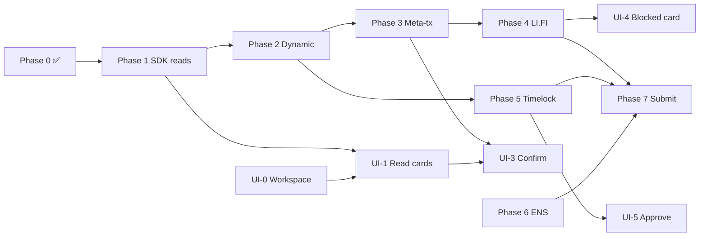

# AgentBlox Roadmap Plan

**Last updated:** June 2026  
**Purpose:** Single source of truth for AgentBlox direction, doc review findings, and phased delivery — hackathon MVP through post-event product.

**Related docs:** [overview.md](./overview.md) (start here) · [implementation-status.md](./implementation-status.md) (live matrix) · [implementation-plan.md](./implementation-plan.md) (task checklist) · [treasury-lifecycle.md](./treasury-lifecycle.md) (product model)

---

## 1. Executive summary

AgentBlox is Particle CS’s **treasury operations platform** for ETHGlobal New York 2026. It demonstrates the [Bloxchain Protocol](https://github.com/PracticalParticle/Bloxchain-Protocol) **AccountBlox pattern as deployed infrastructure** — without modifying `contracts/core/`.

| What it is | What it is not |
|------------|----------------|
| Policy-gated treasury workspace (agent + human) | A Bloxchain protocol fork or upgrade |
| Copilot + treasury tools over AccountBlox clones | A generic chatbot without on-chain enforcement |
| Showcase for Dynamic + LI.FI + ENS | A replacement for [bloxchain.app](https://bloxchain.app/) provisioning |

**One-line pitch:**  
*Dynamic holds the keys. LI.FI runs the flows. ENS names the actors. Bloxchain decides what anyone is allowed to trigger.*

**Strategic goal:** Win sponsor prizes *and* establish long-term partnership positioning — Bloxchain as the authorization layer between custody (Dynamic) and execution (LI.FI), with ENS as discoverable identity.

---

## 2. Documentation review

The `docs/` folder is **mature and well-structured** after the Copilot pivot and lifecycle reorganization. Strengths and gaps:

### Strengths

| Area | Assessment |
|------|------------|
| **Product model** | [treasury-lifecycle.md](./treasury-lifecycle.md) is an excellent master guide — create → configure → operate → govern → extend |
| **Integration specs** | `integrations/` folder cleanly separates sponsors from protocol ([guard-controller.md](./guard-controller.md)) |
| **Execution model** | [on-chain-execution-flow.md](./on-chain-execution-flow.md) + [treasury-tools.md](./treasury-tools.md) are aligned on two auth paths |
| **UI vision** | [ui-ux-guidelines.md](./ui-ux-guidelines.md) articulates control-surface-over-chat with agentic UX patterns |
| **Event context** | [event/ethglobal-2026.md](./event/ethglobal-2026.md) isolates hackathon-specific content |
| **Extensibility** | [governance.md](./governance.md) + [extending-use-cases.md](./extending-use-cases.md) support post-hackathon narrative |

### Gaps and inconsistencies (resolve during implementation)

| Issue | Location | Resolution |
|-------|----------|------------|
| **Surface naming drift** | README vs [index.md](./index.md) vs [architecture.md](./architecture.md) | README still says "Copilot + Console"; docs target **Workspace + Setup**. Update README when UI-0 lands |
| **Dual planning docs** | [implementation-plan.md](./implementation-plan.md) vs this file | **ROADMAP-PLAN** = strategy + milestones; **implementation-plan** = task checklist; **implementation-status** = live matrix |
| **Client vs server SDK path** | ~~`src/lib/bloxchain.ts`~~ | Resolved — all SDK reads/signing use `server/bloxchain.ts` |
| **Stale code reference** | ~~`src/lib/agent-api.ts`~~ | Removed — use `src/lib/execute-api.ts` (Phase 3 ✅) |
| **Orphan pages** | `DashboardPage`, `AgentFlowsPage`, `TreasurySetupPage` | Delete or fold into Workspace/Setup during UI-0 |
| **Demo script visibility** | [demo-script.md](./demo-script.md) marked internal | Keep for rehearsal; link from ROADMAP only |

### Doc maintenance rule

When a phase completes:

1. Update [implementation-status.md](./implementation-status.md)
2. Check off tasks in [implementation-plan.md](./implementation-plan.md)
3. Update affected integration doc if API/flow changed

---

## 3. Current state assessment

**Overall: ~50% implementation, ~50% specification** (Phases 0–1 and 3 complete; Phase 2 scaffold done; Phase 4–7 pending).

### Working today

- Vite 5 + React + TypeScript + Node server (`npm run dev:all`)
- Copilot chat UI with LLM + slash-command fallback
- 8 treasury tools registered with off-chain policy gate
- Real Sepolia ETH balance + SDK reads (`/pending`, `/whitelist`, on-chain roles in `/status`)
- Mainnet ENS resolution
- Dynamic `DynamicWidget` in header; Dynamic Node SDK scaffold for Broadcaster
- Meta-tx signing + `POST /api/execute/rebalance` + Copilot Confirm button
- Vitest unit tests (`npm run test`)
- Comprehensive documentation (23 files)

### Not working yet (blocks full demo)

| Capability | Blocker |
|------------|---------|
| On-chain rebalance success | Env (Dynamic + AGENT_POLICY + execution target) + Phase 4 LI.FI compose |
| Real LI.FI quote preview | Phase 4 — `server/lifi/compose.ts` |
| Timelock payment approval | Phase 5 — `executeWithTimeLock` + Owner approve |
| On-chain attack revert demo | Phase 4 — optional Broadcaster submit |
| Typed Intent Preview cards | UI-3 — `RebalanceProposalCard` (basic Confirm exists in `ToolResultCard`) |
| Workspace control surface | UI-0 — three-column layout |

### Hackathon definition of done

From [implementation-plan.md](./implementation-plan.md) and [event/ethglobal-2026.md](./event/ethglobal-2026.md):

- [ ] Treasury provisioned on Sepolia via bloxchain.app
- [ ] `/rebalance` → signed meta-tx → LI.FI Composer executes on-chain
- [ ] `/attack` → off-chain block + optional on-chain `TargetNotWhitelisted` revert
- [ ] `/pay` → timelock → Dynamic Owner approves
- [ ] `/ens` resolves treasury + `bloxchain.*` text records
- [ ] Demo video + submission; ENS booth presentation Sunday AM

---

## 4. Roadmap horizons

### Horizon A — Hackathon MVP (now → event)

**Goal:** Demoable end-to-end flows for judges and sponsor booths.

**Must ship:**

1. On-chain reads (Phase 1) ✅
2. Dynamic Broadcaster (Phase 2) — scaffold done; env pending
3. Meta-tx sign + execute (Phase 3) ✅ — end-to-end needs env + Phase 4 calldata
4. LI.FI Composer integration (Phase 4)
5. Timelock payments (Phase 5)
6. ENS read polish (Phase 6 partial) — read ✅
7. Minimum viable Workspace UI (UI-0 + UI-1 + UI-3 + UI-5) — UI-3 Confirm partial

**Can defer if behind:**

- ENS write / text record updates
- Full Setup wizard (keep Console checklist)
- LLM natural language (slash commands sufficient)
- Mobile responsive layout
- `?demo=1` mode
- On-chain governance UI

**Never cut:**

- GuardController whitelist block demo (`/attack`)
- Meta-tx two-party success path (signer ≠ executor)
- Lane B timelock approval
- On-chain tx hashes in UI

### Horizon B — Post-hackathon product (Q3 2026)

**Goal:** Usable treasury ops platform for early adopters.

- Full Workspace (UI-0 through UI-6)
- Setup wizard with live policy verification
- MCP export of treasury tools for external agents
- Multi-treasury support (stretch)
- Optional local LLM via same tool registry
- Production hardening: error boundaries, retry, observability

### Horizon C — Partnership & protocol narrative

**Goal:** Convert sponsor demos into ongoing integrations.

| Partner | AgentBlox proof point | Follow-up |
|---------|----------------------|-----------|
| **Dynamic** | Owner + Broadcaster role separation | Reference architecture doc for agentic treasuries |
| **LI.FI** | Composer behind GuardController whitelist | Co-marketing: "policy-gated Composer" pattern |
| **ENS** | `bloxchain.*` text records for agent discovery | Standard text record schema proposal |
| **Bloxchain** | AccountBlox as load-bearing infra | bloxchain.app → AgentBlox handoff flow |

---

## 5. Phased delivery plan

Estimates assume 2–3 engineers. Backend and UI phases **run in parallel** where dependencies allow.

### Milestone map

```text
Week 1 (critical path)
├── M1: Real on-chain reads          Phase 1
├── M2: Dynamic Broadcaster          Phase 2
└── UI-0: Workspace shell            (parallel)

Week 2 (core demo)
├── M3: Meta-tx sign + confirm       Phase 3 + UI-3
├── M4: LI.FI compose + execute      Phase 4 + UI-4
└── UI-1: Typed read cards           (parallel)

Week 3 (full story)
├── M5: Timelock payments            Phase 5 + UI-5
├── M6: ENS + polish                 Phase 6–7
└── M7: Demo video + submission
```

---

### Phase 1 — Bloxchain SDK reads

**Goal:** `/pending` and `/whitelist` return real Sepolia data; status shows on-chain roles.

| Task | Deliverable | Acceptance |
|------|-------------|------------|
| `server/bloxchain.ts` | SDK client factory | GuardController + SecureOwnable instances |
| `list_pending_approvals` | TxRecord poll | Returns PENDING txs with releaseTime |
| `get_whitelisted_targets` | Whitelist read | Returns addresses per known selector |
| Enhance `get_treasury_status` | On-chain roles | Owner, Broadcaster from contract |

**Depends on:** `TREASURY_ADDRESS` configured  
**Hours:** ~4h  
**Status:** ✅ Done

---

### Phase 2 — Dynamic integration

**Goal:** Owner connects in UI; Broadcaster server wallet submits txs.

| Task | Deliverable | Status |
|------|-------------|--------|
| `@dynamic-labs-wallet/node-evm` | Server wallet module | ✅ Installed |
| `server/dynamic/client.ts` | API client | ✅ |
| `server/dynamic/broadcaster.ts` | Submit helper | ✅ |
| Owner address verify | Setup check | Pending (UI-2) |
| Env configured | `DYNAMIC_API_TOKEN`, `BROADCASTER_WALLET_ADDRESS` | ⬜ Operator |

**Depends on:** Dynamic dashboard (Sepolia, embedded wallets, CORS)  
**Hours:** ~5h

---

### Phase 3 — Meta-tx sign + confirm ✅

**Goal:** `/rebalance` produces signed meta-tx; user confirms → Broadcaster executes.

| Task | Deliverable | Status |
|------|-------------|--------|
| `server/signing/meta-tx.ts` | EIP-712 signing | ✅ |
| `server/signing/serialize.ts` | JSON-safe meta-tx | ✅ |
| `server/execution/rebalance.ts` | Broadcaster submit | ✅ |
| Extend `propose_rebalance` | `signedMetaTx` in tool result | ✅ |
| `POST /api/execute/rebalance` | Confirm endpoint | ✅ |
| `ToolResultCard` Confirm button | Basic confirm UX | ✅ (UI-3 typed card deferred) |

**Env to test end-to-end:** `AGENT_POLICY_PRIVATE_KEY`, `REBALANCE_EXECUTION_TARGET`, `LIFI_EXECUTION_SELECTOR`, Dynamic Broadcaster vars.

**Depends on:** Phase 2, AGENT_POLICY key matches on-chain role  
**Hours:** ~6h backend + 3h UI

---

### Phase 4 — LI.FI + whitelist guard

**Goal:** Composer flow as whitelisted target; attack demo shows revert.

| Task | Deliverable | Acceptance |
|------|-------------|------------|
| Provisioning whitelist | userProxy + factory | [guard-controller.md](./guard-controller.md) |
| `server/lifi/compose.ts` | Composer API / SDK | Returns userProxy + calldata |
| `get_lifi_quote_preview` | Real quote | Route + fees in card |
| Attack on-chain (optional) | Etherscan revert tx | `TargetNotWhitelisted` |
| `PolicyBlockedCard` | Demo polish | UI-4 |

**Depends on:** Phase 3, LI.FI flow ID tested on Sepolia  
**Hours:** ~4h backend + 2h UI

---

### Phase 5 — Timelock payments

**Goal:** `/pay` → PENDING → Owner approves → COMPLETED.

| Task | Deliverable | Acceptance |
|------|-------------|------------|
| `request_vendor_payment` on-chain | `executeWithTimeLock` | TxRecord created |
| `/pending` countdown | releaseTime display | From Phase 1 reads |
| Owner approve | Dynamic wallet | `approveTimeLockExecution` |
| `PaymentRequestCard` | Approve as Owner | UI-5 |

**Depends on:** Phase 2, USDC whitelisted  
**Hours:** ~4h backend + 2h UI

---

### Phase 6 — ENS integration

**Goal:** Functional ENS in demo and booth.

| Task | Deliverable | Acceptance |
|------|-------------|------------|
| Read (done) | `resolve_ens_treasury` | `/ens` works |
| Write helpers | `setAddr` + `setText` via Owner | Optional MVP |
| Flow ID from ENS | `bloxchain.allowedFlows` | Policy alignment |
| Setup persistence | localStorage + env | Import treasury + ENS |

**Hours:** ~3h

---

### Phase 7 — Polish & submission

| Task | Deliverable |
|------|-------------|
| Demo video | 3-min Copilot/Workspace recording |
| README + Etherscan links | Public repo ready |
| ETHGlobal submission | Project URL + description |
| ENS booth rehearsal | Live `/ens` + `/rebalance` |
| Deploy (optional) | Vercel frontend + server |

**Hours:** ~4h

---

### UI phases (parallel track)

See [ui-ux-guidelines.md](./ui-ux-guidelines.md) for full spec.

| Phase | Focus | Backend dep. | Priority |
|-------|-------|--------------|----------|
| **UI-0** | Workspace shell (3-column) | Phase 0 ✅ | P0 — start with Phase 1 |
| **UI-1** | Typed read cards | Phase 1 | P0 |
| **UI-2** | Setup wizard `/setup` | Phase 2 | P1 |
| **UI-3** | Intent Preview + Confirm | Phase 3 | P0 |
| **UI-4** | LI.FI + PolicyBlocked cards | Phase 4 | P0 |
| **UI-5** | Timelock approve + countdown | Phase 5 | P0 |
| **UI-6** | Demo polish | Phase 7 | P2 |

**UI strategy for hackathon:** Ship UI-0 + UI-1 early (legibility for judges), then UI-3/UI-4/UI-5 as backend phases complete. Copilot chat remains embedded in Action center — not removed.

---

## 6. Critical path (ordered)

This is the **minimum sequence** for a complete demo:



**Provisioning (parallel, human):** [provisioning-checklist.md](./provisioning-checklist.md) — must complete before Phase 3 testing.

---

## 7. Risk register

| Risk | Impact | Mitigation |
|------|--------|------------|
| Treasury not provisioned in time | Blocks all on-chain phases | Start bloxchain.app setup Day 1; use protocol sanity scripts as reference |
| LI.FI Composer selector / proxy mismatch | Rebalance reverts | Follow [integrations/lifi.md](./integrations/lifi.md); test compose before whitelist |
| AGENT_POLICY key ≠ on-chain role | Meta-tx fails | Verify in Setup step 3 |
| Dynamic server wallet API friction | Broadcaster blocked | Fallback: local Broadcaster key for demo only (document clearly) |
| Scope creep (full Workspace) | Misses chain execution | UI-0 shell + typed cards only; defer Settings, mobile, demo mode |
| Doc/code drift | Confuses team | Update implementation-status per phase (see §2) |
| ENS booth without live ENS | Lose ENS prize track | Register demo name early; `/ens` rehearsed |

---

## 8. Success metrics

| Metric | Target | When |
|--------|--------|------|
| Time to first `/status` with real data | < 5 min after clone | After Phase 1 + provisioning |
| End-to-end rebalance tx on Sepolia | 1+ success hash | Phase 4 |
| Attack demo clarity | "Policy worked" not "Error" | UI-4 |
| Demo without narrator | [demo-script.md](./demo-script.md) beats visible in UI | Phase 7 |
| Sponsor story in UI | User names all 4 layers | UI-0 integration stack |
| Four integration docs match code | No stub notes in demo path | Phase 7 |

---

## 9. Immediate next steps

**Sprint 1:**

1. ✅ Create this roadmap
2. ✅ Phase 1 — SDK reads in `server/bloxchain.ts` + read tools
3. **Provisioning** — Clone AccountBlox on Sepolia; set full execution env
4. **UI-0** — Workspace shell (can parallelize)

**Sprint 2:**

5. Phase 2 Dynamic Broadcaster — scaffold ✅; set env vars
6. ✅ Phase 3 meta-tx + Confirm in `ToolResultCard`
7. UI-1 typed read cards

**Sprint 3 (current focus):**

8. **Phase 4** LI.FI compose + real quote preview
9. Phase 5 timelock + UI-4, UI-5
10. Phase 7 demo + submission

---

## 10. File ownership map

| Path | Owner phase | Purpose |
|------|-------------|---------|
| `server/bloxchain.ts` | 1 | SDK factory (reads) |
| `server/dynamic/*` | 2 | Broadcaster |
| `server/signing/meta-tx.ts` | 3 | AGENT_POLICY EIP-712 |
| `server/lifi/compose.ts` | 4 | LI.FI compose |
| `server/tools/read.ts` | 1 | Monitor tools |
| `server/tools/propose.ts` | 3–5 | Propose tools |
| `src/pages/WorkspacePage.tsx` | UI-0 | Primary surface |
| `src/pages/SetupPage.tsx` | UI-2 | Setup wizard |
| `src/components/cards/*` | UI-1+ | Typed tool cards |
| `src/lib/execute-api.ts` | 3 | Client confirm → `/api/execute/rebalance` |

---

## 11. Related documents

| Doc | Role |
|-----|------|
| [overview.md](./overview.md) | **Executive snapshot** — status, next steps, blockers |
| [ROADMAP-PLAN.md](./ROADMAP-PLAN.md) | Strategy, milestones, risks |
| [implementation-plan.md](./implementation-plan.md) | Task checklist per phase |
| [implementation-status.md](./implementation-status.md) | Live build matrix |
| [treasury-lifecycle.md](./treasury-lifecycle.md) | Product lifecycle guide |
| [ui-ux-guidelines.md](./ui-ux-guidelines.md) | UI spec |
| [demo-script.md](./demo-script.md) | Rehearsal script |
| [event/ethglobal-2026.md](./event/ethglobal-2026.md) | Event + sponsors |
