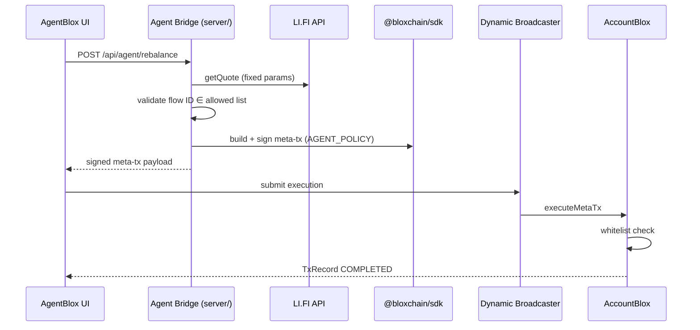

# Agent Bridge

The Agent Bridge is a **server-side policy service** that proposes treasury actions and signs EIP-712 meta-transactions. It does **not** execute on-chain transactions — Dynamic Broadcaster does.

## Design principles

| Principle | Implementation |
|-----------|----------------|
| **No LLM for hackathon** | Hardcoded deterministic flows |
| **Agent-ready** | HTTP API designed for future MCP/Hermes/OpenClaw |
| **Sign only** | Holds `AGENT_POLICY` key, never Broadcaster key |
| **Policy before sign** | Validate against whitelist manifest + ENS text records |

## Architecture



## Server location

```
server/
├── index.ts              # HTTP server + routing
├── flows/
│   ├── rebalance.ts      # Lane A — deterministic rebalance
│   └── simulate-attack.ts # Lane A — blocked transfer demo
├── signing/
│   └── meta-tx.ts        # EIP-712 signing with AGENT_POLICY key
└── dynamic/
    └── broadcaster.ts    # Submit signed meta-tx (Phase 2)
```

## Environment variables

```env
AGENT_POLICY_PRIVATE_KEY=0x...   # Server only — NEVER in VITE_
PORT=3001
DYNAMIC_API_TOKEN=...            # For Broadcaster execution
```

## API specification

### `GET /api/health`

```json
{ "status": "ok", "service": "agent-bridge" }
```

### `POST /api/agent/rebalance`

**Request:**

```json
{
  "treasuryAddress": "0x..."
}
```

**Response (success):**

```json
{
  "flowId": "rebalance-sepolia-v1",
  "target": "0x...",
  "calldata": "0x...",
  "value": "0",
  "signedMetaTx": { }
}
```

**Logic (`server/flows/rebalance.ts`):**

1. Read treasury token balances via viem
2. If USDC balance ≤ threshold → return `{ skipped: true, reason: "below threshold" }`
3. Call LI.FI `getQuote` with **fixed** token pair and amount
4. Verify `quote.tool === 'composer'`
5. Verify flow ID in allowed list (from ENS text record or env constant)
6. Build unsigned meta-tx via `@bloxchain/sdk`
7. Sign with `AGENT_POLICY_PRIVATE_KEY`
8. Return signed payload

### `POST /api/agent/simulate-attack`

**Request:**

```json
{
  "treasuryAddress": "0x..."
}
```

**Response:**

```json
{
  "target": "0xAttacker...",
  "calldata": "0x...",
  "signedMetaTx": { },
  "expectedError": "TargetNotWhitelisted"
}
```

Builds meta-tx to **non-whitelisted** target. Broadcaster submission should revert. UI displays blocked state.

### `POST /api/agent/request-payment` (Lane B — stretch)

**Request:**

```json
{
  "treasuryAddress": "0x...",
  "recipient": "0x...",
  "amount": "1000000",
  "token": "0xUSDC..."
}
```

Creates timelock request (may be initiated from frontend with Analyst wallet instead).

## Deterministic policy rules

Configure in `server/flows/config.ts`:

```typescript
export const AGENT_POLICY = {
  rebalance: {
    enabled: true,
    usdcThreshold: 10_000_000n, // 10 USDC (6 decimals)
    fromToken: '0x...',
    toToken: '0x...',
    fromAmount: '1000000',
    allowedFlowIds: ['rebalance-sepolia-v1'],
  },
} as const;
```

No LLM. Same inputs → same outputs every demo run.

## Signing (`server/signing/meta-tx.ts`)

Use `@bloxchain/sdk` meta-tx utilities — align with Bloxchain Protocol:

- `sdk/typescript/utils/metaTx/metaTransaction.tsx`
- `test/foundry/integration/MetaTransaction.t.sol`

```typescript
// Pseudocode
import { privateKeyToAccount } from 'viem/accounts';

const agentAccount = privateKeyToAccount(process.env.AGENT_POLICY_PRIVATE_KEY);

// 1. createMetaTxParams(target, value, selector, encodedParams, ...)
// 2. generateUnsignedMetaTransactionForNew(...)
// 3. signTypedData with agentAccount
// 4. return { metaTx, signature }
```

## Frontend client

`src/lib/agent-api.ts` (stub exists):

```typescript
export async function proposeRebalance(treasuryAddress: string) {
  const res = await fetch('/api/agent/rebalance', {
    method: 'POST',
    headers: { 'Content-Type': 'application/json' },
    body: JSON.stringify({ treasuryAddress }),
  });
  return res.json();
}
```

Vite proxies `/api` → `localhost:3001` (see `vite.config.ts`).

## Future: Hermes / OpenClaw integration

Post-hackathon, expose same endpoints as MCP tools:

| MCP tool | Maps to |
|----------|---------|
| `agentblox_propose_rebalance` | `POST /api/agent/rebalance` |
| `agentblox_simulate_attack` | `POST /api/agent/simulate-attack` |
| `agentblox_get_treasury_state` | `GET /api/treasury/:address` |

README section:

> The Agent Bridge API is agent-framework agnostic. Hermes or OpenClaw replaces the "Run Rebalance" button by calling the same endpoints. Policy validation and signing remain server-side.

### Do not for hackathon

- Install Hermes/OpenClaw
- Add LLM dependency
- Let LLM sign meta-txs directly

## Security

| Rule | Reason |
|------|--------|
| `AGENT_POLICY_PRIVATE_KEY` server-only | Signing key must not leak to browser |
| Validate flow IDs before sign | Defense in depth before on-chain whitelist |
| Rate-limit `/api/agent/*` | Prevent demo abuse |
| Log all proposals | Audit trail for debugging |

## Running

```bash
npm run dev:server     # Agent Bridge only
npm run dev:all        # Frontend + Agent Bridge
```

## Testing

```bash
curl http://localhost:3001/api/health

curl -X POST http://localhost:3001/api/agent/rebalance \
  -H "Content-Type: application/json" \
  -d '{"treasuryAddress":"0x..."}'
```

## Files to implement

| File | Status |
|------|--------|
| `server/index.ts` | Stub done |
| `server/flows/rebalance.ts` | Pending |
| `server/flows/simulate-attack.ts` | Pending |
| `server/flows/config.ts` | Pending |
| `server/signing/meta-tx.ts` | Pending |
| `src/lib/agent-api.ts` | Stub done |

## Demo narrative

> "This is a policy agent — not a chatbot. It runs deterministic rules, proposes actions, and signs meta-transactions. It cannot execute or drain funds. The same API is ready for Hermes or OpenClaw when we add LLM reasoning later."
