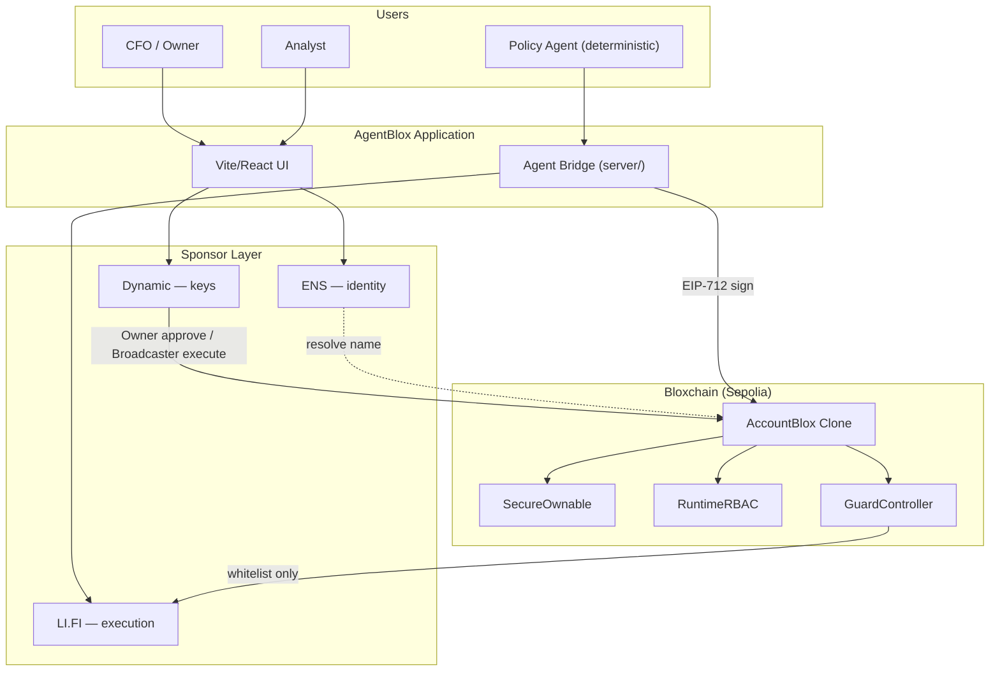

# Architecture

## Overview

AgentBlox is a **treasury operations workspace** that consumes AccountBlox clones provisioned on [bloxchain.app](https://bloxchain.app/). It does not modify Bloxchain core contracts.

Three products, one security model:

```
bloxchain.app     →  birth certificate (clone + roles + whitelist)
AgentBlox         →  control tower (ops, ENS, agents, approvals)
Bloxchain Protocol →  constitution (enforced on-chain)
```

## Layer diagram



## Sponsor layer cake

```
┌─────────────────────────────────────┐
│  ENS — who is this actor?           │
├─────────────────────────────────────┤
│  Bloxchain — what may they do?      │  ← Particle CS framework
├─────────────────────────────────────┤
│  Dynamic — who signs?               │
├─────────────────────────────────────┤
│  LI.FI — how does execution run?    │
└─────────────────────────────────────┘
```

## Role model

AccountBlox composes **SecureOwnable + RuntimeRBAC + GuardController**. Configure at provisioning time on bloxchain.app; AgentBlox reads and uses these roles.

| Bloxchain role | Holder | Lane A (Agentic) | Lane B (Fintech) |
|----------------|--------|------------------|------------------|
| **Owner** | Dynamic embedded wallet | Approve policy/whitelist changes | Approve vendor payments |
| **Broadcaster** | Dynamic server wallet | Execute agent meta-txs | Execute approved ops |
| **Recovery** | Cold backup address | Emergency rotation | Emergency rotation |
| **AGENT_POLICY** | Agent Bridge key | Sign meta-tx only — never execute | — |
| **ANALYST** | Ops user (Dynamic or EOA) | — | Request timelock payments |

### Key invariant

**Signer ≠ executor** for meta-tx flows. `AGENT_POLICY` can sign proposals but cannot submit `executeMetaTx`. Only Broadcaster executes. Enforced in EngineBlox, not application code.

## Transaction patterns

### Pattern 1 — Meta-tx (Lane A)

```
Agent Bridge → EIP-712 sign (AGENT_POLICY)
     ↓
Dynamic Broadcaster → requestAndApproveExecution / executeMetaTx
     ↓
GuardController → whitelist check
     ↓
LI.FI Composer → atomic flow
```

### Pattern 2 — Timelock (Lane B)

```
Analyst → executeWithTimeLock request
     ↓
TxRecord status: PENDING (countdown)
     ↓
Owner (Dynamic) → approveTimeLockExecution
     ↓
TxRecord status: COMPLETED
```

## Repository layout

| Path | Responsibility |
|------|----------------|
| `src/pages/` | UI routes: dashboard, treasury setup, agent flows |
| `src/lib/config.ts` | Sepolia addresses, ENS text key constants |
| `src/lib/ens.ts` | ENS resolution helpers (viem) |
| `src/lib/agent-api.ts` | Client for Agent Bridge HTTP API |
| `server/index.ts` | Agent Bridge: policy validation + EIP-712 signing |
| `docs/` | Implementation guides |

## Data handoff: bloxchain.app → AgentBlox

bloxchain.app provisions the treasury. AgentBlox imports by:

1. **Treasury address** — AccountBlox clone on Sepolia
2. **Optional ENS name** — configured in AgentBlox (not bloxchain.app)
3. **On-chain reads** — roles, whitelist, timelock via `@bloxchain/sdk`

Future: treasury manifest JSON exported from bloxchain.app with metadata (allowed flow IDs, policy version).

## Security boundaries

| Component | Can sign txs? | Can execute on-chain? | Holds private keys? |
|-----------|---------------|----------------------|---------------------|
| Web UI (Owner) | Via Dynamic embedded | Approve timelock only | No (Dynamic MPC) |
| Agent Bridge | AGENT_POLICY meta-tx only | No | Yes (agent key only) |
| Dynamic Broadcaster | Yes | Yes (after Bloxchain checks) | Yes (server wallet) |
| LI.FI | No | Via AccountBlox call | No |

## Agent strategy

| Phase | Approach |
|-------|----------|
| Hackathon | Hardcoded deterministic flows in `server/` |
| Post-hackathon | Hermes/OpenClaw via MCP calling same Agent Bridge API |
| Never | LLM directly holds Broadcaster key or bypasses whitelist |

## Network

- **Primary:** Sepolia testnet
- **Bloxchain addresses:** See `src/lib/config.ts` and Bloxchain `deployed-addresses.json`

## What we do not build

- Changes to `contracts/core/`
- ENS provisioning in bloxchain.app
- LLM reasoning layer for hackathon demo
- Ledger integration (Phase 2 / enterprise hardening)
