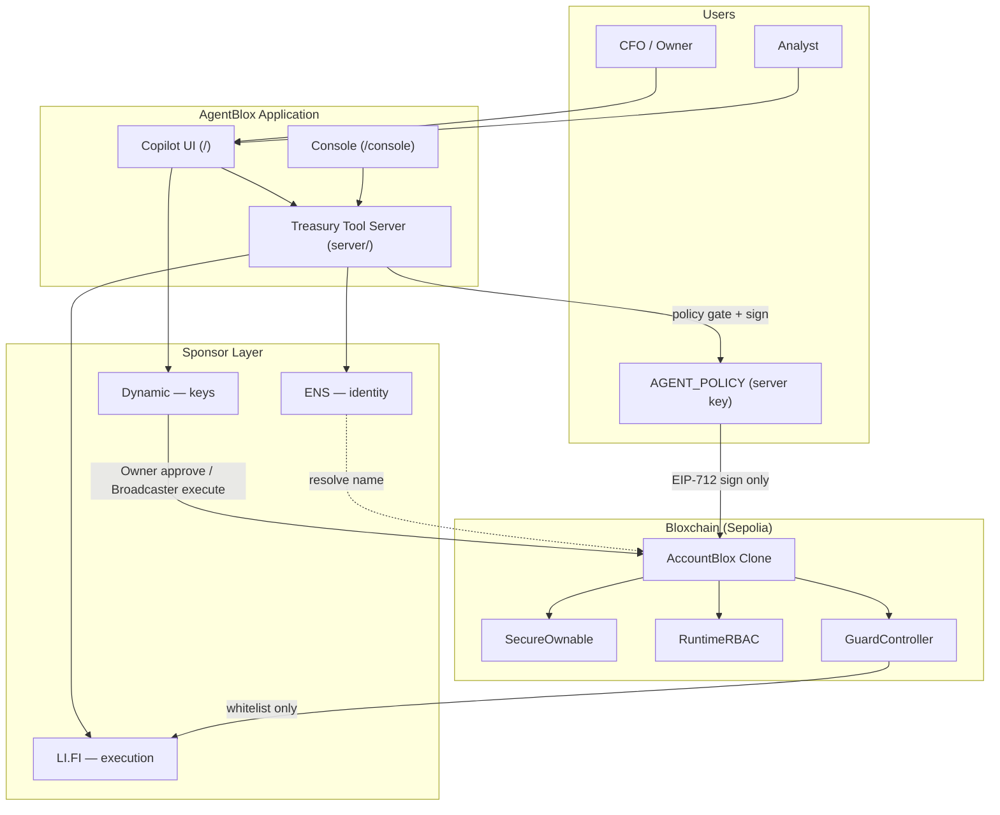

# Architecture

## Overview

AgentBlox is a **Copilot-first treasury platform**. Users operate treasuries through conversation; treasury tools and Bloxchain enforce policy before anything executes on-chain.

```
bloxchain.app     →  provision AccountBlox (clone + roles + whitelist)
AgentBlox Console →  env checklist + treasury import reference
AgentBlox Copilot →  day-to-day ops via treasury tools (/api/chat)
Bloxchain Protocol →  on-chain constitution
```

## Layer diagram



## Sponsor layer cake

```
┌─────────────────────────────────────┐
│  ENS — who is this actor?           │
├─────────────────────────────────────┤
│  Bloxchain — what may they do?      │  ← Particle CS framework
├─────────────────────────────────────┤
│  Dynamic — who signs?               │
├─────────────────────────────────────┤
│  LI.FI — how does execution run?    │
└─────────────────────────────────────┘
```

## Role model

AccountBlox composes **SecureOwnable + RuntimeRBAC + GuardController**. Configure at provisioning time on bloxchain.app; AgentBlox reads and uses these roles.

| Bloxchain role | Holder | Lane A (Agentic) | Lane B (Fintech) |
|----------------|--------|------------------|------------------|
| **Owner** | Dynamic embedded wallet | Approve policy/whitelist changes | Approve vendor payments |
| **Broadcaster** | Dynamic server wallet | Execute agent meta-txs | Execute approved ops |
| **Recovery** | Cold backup address | Emergency rotation | Emergency rotation |
| **AGENT_POLICY** | Server signing key | Sign meta-tx only — never execute | — |
| **ANALYST** | Ops user (Dynamic or EOA) | — | Request timelock payments |

### Key invariant

**Signer ≠ executor** for meta-tx flows. `AGENT_POLICY` can sign proposals but cannot submit `requestAndApproveExecution`. Only Broadcaster executes. Enforced in EngineBlox, not application code.

## Transaction patterns

See [on-chain-execution-flow.md](./on-chain-execution-flow.md) for full sequences.

### Pattern 1 — Meta-tx (Lane A)

```
Copilot propose_rebalance → AGENT_POLICY EIP-712 sign
     ↓
Dynamic Broadcaster → requestAndApproveExecution
     ↓
GuardController → whitelist check
     ↓
LI.FI Composer user proxy → atomic flow
```

### Pattern 2 — Timelock (Lane B)

```
Copilot request_vendor_payment → executeWithTimeLock
     ↓
TxRecord status: PENDING (countdown)
     ↓
Owner (Dynamic) → approveTimeLockExecution
     ↓
TxRecord status: COMPLETED
```

## Repository layout

| Path | Responsibility |
|------|----------------|
| `src/pages/CopilotPage.tsx` | Primary chat UI (`/`) |
| `src/pages/ConsolePage.tsx` | Setup + env checklist (`/console`) |
| `src/components/chat/` | Chat UI, tool result cards |
| `src/lib/config.ts` | Sepolia addresses, ENS text keys |
| `src/lib/ens.ts` | ENS read helpers (viem) |
| `server/index.ts` | HTTP: `/api/health`, `/api/chat` |
| `server/tools/` | Treasury tool registry (read + propose) |
| `server/chat/` | LLM handler + fallback slash router |
| `server/policy-gate.ts` | Off-chain validation |
| `server/signing/` | Meta-tx signing (Phase 3 — planned) |
| `server/dynamic/` | Broadcaster submit (Phase 2 — planned) |
| `docs/` | Implementation guides |

**Orphan pages** (not routed): `DashboardPage`, `AgentFlowsPage`, `TreasurySetupPage` — functionality moved to Copilot + Console.

## Data handoff: bloxchain.app → AgentBlox

bloxchain.app provisions the treasury. AgentBlox consumes it via:

1. **Treasury address** — `TREASURY_ADDRESS` in `.env`
2. **Optional ENS name** — `ENS_NAME` (configured in AgentBlox, not bloxchain.app)
3. **On-chain reads** — roles, whitelist, timelock via `@bloxchain/sdk` (Phase 1+)

See [provisioning-checklist.md](./provisioning-checklist.md).

## Security boundaries

| Component | Can sign txs? | Can execute on-chain? | Holds private keys? |
|-----------|---------------|----------------------|---------------------|
| Copilot UI (Owner) | Via Dynamic embedded | Approve timelock only | No (Dynamic MPC) |
| Treasury tool server | AGENT_POLICY meta-tx only | No | Yes (agent key only) |
| Dynamic Broadcaster | Yes | Yes (after Bloxchain checks) | Yes (server wallet) |
| LI.FI | No | Via AccountBlox call | No |
| LLM (optional) | No | No — calls tools only | No |

## Agent strategy

| Phase | Approach |
|-------|----------|
| Hackathon | Deterministic tools + slash commands; optional LLM |
| Post-hackathon | Export same tools as MCP for Hermes/OpenClaw |
| Never | LLM holds Broadcaster key or bypasses whitelist |

## Network

- **Primary:** Sepolia testnet
- **ENS resolution:** Ethereum mainnet (for `.eth` names)
- **Bloxchain addresses:** See `src/lib/config.ts` and Bloxchain `deployed-addresses.json`

## What we do not build

- Changes to `contracts/core/`
- ENS provisioning in bloxchain.app
- Ledger integration (enterprise stretch)
- Legacy Agent Bridge REST API (`/api/agent/*`) — superseded by Copilot tools

## Related docs

- [implementation-status.md](./implementation-status.md) — what is built today
- [treasury-tools.md](./treasury-tools.md) — tool catalog
- [guard-controller-setup.md](./guard-controller-setup.md) — LI.FI + GuardController
