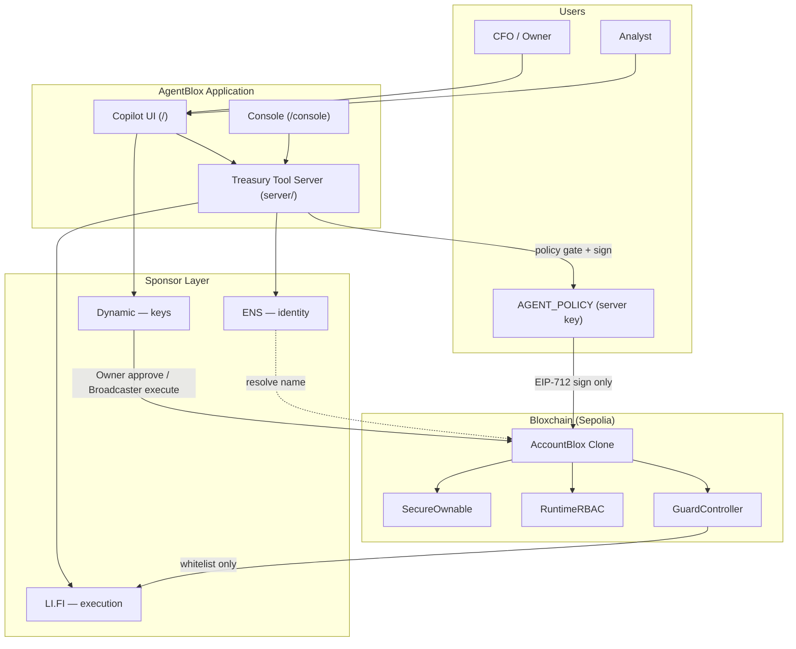

# Architecture

## Overview

AgentBlox is a **Copilot-first treasury platform**. Users operate treasuries through conversation; treasury tools and Bloxchain enforce policy before anything executes on-chain.

```
bloxchain.app     →  provision AccountBlox (clone + roles + whitelist)
AgentBlox Console →  env checklist + treasury import reference
AgentBlox Copilot →  day-to-day ops via treasury tools (/api/chat)
Bloxchain Protocol →  on-chain constitution
```

Master guide: [treasury-lifecycle.md](./treasury-lifecycle.md)

## Layer diagram



## Sponsor layer cake

```
┌─────────────────────────────────────┐
│  ENS — who is this actor?           │
├─────────────────────────────────────┤
│  Bloxchain — what may they do?      │
├─────────────────────────────────────┤
│  Dynamic — who signs?               │
├─────────────────────────────────────┤
│  LI.FI — how does execution run?    │
└─────────────────────────────────────┘
```

Integration docs: [integrations/README.md](./integrations/README.md)

## Role model

AccountBlox composes **SecureOwnable + RuntimeRBAC + GuardController**. Configure at provisioning; AgentBlox reads and uses these roles.

| Role | Holder | Policy execution | Timelock payments | Governance |
|------|--------|------------------|-------------------|------------|
| **Owner** | Dynamic embedded | — | Approve | Approve config changes |
| **Broadcaster** | Dynamic server | Execute meta-tx | Execute approved | Execute config meta-tx |
| **Recovery** | Cold backup | — | — | Emergency rotation |
| **AGENT_POLICY** | Server key | Sign only — never execute | — | — |
| **ANALYST** | Ops wallet | — | Request payments | — |

### Key invariant

**Signer ≠ executor** for meta-tx flows. `AGENT_POLICY` signs proposals; only Broadcaster executes. Enforced in EngineBlox.

## Transaction patterns

See [on-chain-execution-flow.md](./on-chain-execution-flow.md) for full sequences.

### Policy execution (meta-tx)

Treasury operations (e.g. LI.FI rebalance): Copilot tool → AGENT_POLICY sign → Broadcaster `requestAndApproveExecution` → whitelist check → external call.

### Timelock (controlled disbursement)

Vendor payments: Copilot tool → `executeWithTimeLock` → PENDING → Owner `approveTimeLockExecution` → COMPLETED.

## Repository layout

| Path | Responsibility |
|------|----------------|
| `src/pages/CopilotPage.tsx` | Primary UI (`/`) — migrating to Workspace per [ui-ux-guidelines.md](./ui-ux-guidelines.md) |
| `src/pages/ConsolePage.tsx` | Setup + env checklist (`/console`) — migrating to `/setup` wizard |
| `src/components/chat/` | Chat input + message thread; tool cards → typed card system |
| `server/tools/` | Treasury tool registry |
| `server/policy-gate.ts` | Off-chain validation |
| `server/signing/` | Meta-tx signing (Phase 3) |
| `server/dynamic/` | Broadcaster submit (Phase 2) |
| `docs/` | Implementation guides |

**Orphan pages** (not routed): `DashboardPage`, `AgentFlowsPage`, `TreasurySetupPage`.

## Data handoff: bloxchain.app → AgentBlox

1. **Treasury address** — `TREASURY_ADDRESS` in `.env`
2. **Optional ENS name** — `ENS_NAME` (AgentBlox only)
3. **On-chain reads** — roles, whitelist via `@bloxchain/sdk`

See [provisioning-checklist.md](./provisioning-checklist.md).

## Security boundaries

| Component | Can sign txs? | Can execute on-chain? | Holds private keys? |
|-----------|---------------|----------------------|---------------------|
| Copilot UI (Owner) | Via Dynamic embedded | Approve timelock only | No (Dynamic MPC) |
| Treasury tool server | AGENT_POLICY meta-tx only | No | Yes (agent key only) |
| Dynamic Broadcaster | Yes | Yes (after Bloxchain checks) | Yes (server wallet) |
| LI.FI | No | Via AccountBlox call | No |
| LLM (optional) | No | No — calls tools only | No |

## Agent strategy

| Phase | Approach |
|-------|----------|
| Current | Deterministic tools + slash commands; optional LLM |
| Future | Export same tools as MCP for external agents |
| Never | LLM holds Broadcaster key or bypasses whitelist |

## Network

- **Primary:** Sepolia testnet
- **ENS resolution:** Ethereum mainnet (for `.eth` names)

## What we do not build

- Changes to `contracts/core/`
- ENS provisioning in bloxchain.app
- Legacy Agent Bridge REST API — superseded by Copilot tools

## Related docs

- [treasury-lifecycle.md](./treasury-lifecycle.md)
- [implementation-status.md](./implementation-status.md)
- [guard-controller.md](./guard-controller.md)
- [governance.md](./governance.md)
- [extending-use-cases.md](./extending-use-cases.md)
