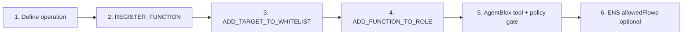

# Extending On-Chain Use Cases

**Audience:** Teams adding capabilities beyond default rebalance and vendor payment.  
**Prerequisites:** [treasury-lifecycle.md](./treasury-lifecycle.md) · [guard-controller.md](./guard-controller.md).  
**See also:** [governance.md](./governance.md) · [treasury-tools.md](./treasury-tools.md)

Every external action uses the same Bloxchain recipe.

---

## Extension recipe



| Step | Layer | Action |
|------|-------|--------|
| 1 | Design | Define contract, function selector, who initiates, auth path |
| 2 | GuardController | `REGISTER_FUNCTION` — see [guard-controller.md](./guard-controller.md) |
| 3 | GuardController | `ADD_TARGET_TO_WHITELIST` per selector |
| 4 | RuntimeRBAC | `ADD_FUNCTION_TO_ROLE` — see [governance.md](./governance.md) |
| 5 | AgentBlox | New tool + `policy-gate.ts` rule |
| 6 | ENS (optional) | `bloxchain.allowedFlows` text record |

---

## Choose an authorization path

| Path | When to use | Initiator | Approver / executor |
|------|-------------|-----------|---------------------|
| **Policy execution** (meta-tx) | Automated, whitelist-bounded ops | AGENT_POLICY signs | Broadcaster executes |
| **Timelock** | Human review before funds move | ANALYST requests | Owner approves after delay |

Both produce **TxRecords**. See [on-chain-execution-flow.md](./on-chain-execution-flow.md).

---

## Example use cases

| Use case | Target to whitelist | Auth path | AgentBlox tool |
|----------|---------------------|-----------|----------------|
| LI.FI rebalance | Composer `userProxy` + factory | Policy execution | `propose_rebalance` ✅ |
| USDC vendor payment | USDC + `transfer(address,uint256)` | Timelock | `request_vendor_payment` ✅ |
| ETH disbursement | Recipient (native transfer selector) | Timelock or meta-tx | *planned* |
| Vault deposit | Vault + `deposit(...)` | Policy execution | *planned* |
| Cross-chain bridge | LI.FI proxy | Policy execution | extend flow IDs — [integrations/lifi.md](./integrations/lifi.md) |
| Payroll batch | USDC transfer × N TxRecords | Timelock each | *planned* |
| Staking | Staking contract + stake selector | Policy execution | *planned* |
| Policy / whitelist change | Config selectors on clone | Timelock | bloxchain.app / SDK |

---

## Execution adapter pattern

Any router or protocol (LI.FI, custom vault, etc.) follows:

```text
Off-chain: provider builds calldata
On-chain:  whitelisted target + selector only
AgentBlox: policy gate before sign; never direct browser execution
```

LI.FI worked example: [integrations/lifi.md](./integrations/lifi.md) + [guard-controller.md](./guard-controller.md).

---

## Adding a Copilot tool

From [treasury-tools.md](./treasury-tools.md):

1. Implement executor in `server/tools/read.ts` or `server/tools/propose.ts`
2. Add Zod schema + `tool()` in `server/tools/index.ts`
3. Add slash command in `server/chat/fallback-router.ts`
4. Add policy-gate rules in `server/policy-gate.ts`
5. Document operation type and auth path in `treasury-tools.md`
6. Wire execution in `server/signing/meta-tx.ts` (policy path) or Dynamic Broadcaster (timelock path)

| Tier | On-chain? | Example |
|------|-----------|---------|
| **Read** | No | Balances, whitelist, pending |
| **Propose** | No until confirmed | Signed meta-tx or timelock request |
| **Execute** | Yes | Broadcaster or Owner after confirm |

---

## Multi-treasury organizations

| Clone | Example ENS | Purpose |
|-------|-------------|---------|
| Operating treasury | `treasury.acme.eth` | Day-to-day ops |
| Payroll | `payroll.acme.eth` | Disbursements |
| Agent sub-account | `agent.acme.eth` | Automated ops |

Multi-tenant registry in AgentBlox is future work.

---

## What you cannot do

- Call non-whitelisted contracts
- Bypass GuardController from UI wallet
- Give AGENT_POLICY Broadcaster permissions
- Modify `contracts/core/`

---

## Verification checklist

- [ ] Function registered in GuardController
- [ ] Target(s) whitelisted for correct selector
- [ ] Role permissions granted
- [ ] Off-chain policy gate validates inputs
- [ ] Sepolia test tx succeeds (or expected revert)
- [ ] ENS `bloxchain.allowedFlows` updated if agent-discoverable
- [ ] Documented in `treasury-tools.md`

---

## Bloxchain references

| Resource | Path |
|----------|------|
| Whitelist tests | `test/foundry/integration/WhitelistWorkflow.t.sol` |
| Meta-tx tests | `test/foundry/integration/MetaTransaction.t.sol` |
| SDK example | `scripts/sanity-sdk/guard-controller/erc20-mint-controller-tests.ts` |
