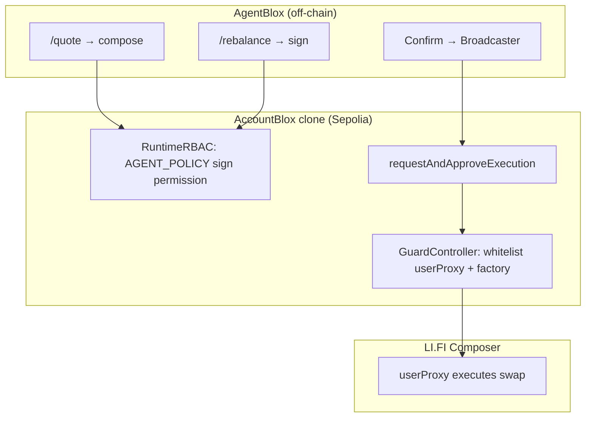

# Getting Started

Step-by-step guide to run AgentBlox locally and connect it to a **new AccountBlox treasury** on Sepolia.

**Time estimate:** 1–2 hours for first-time setup (on-chain provisioning + env + verification).

**Related docs:** [provisioning-checklist.md](./provisioning-checklist.md) (checklist format) · [env-configuration.md](./env-configuration.md) (full env reference) · [guard-controller.md](./guard-controller.md) (whitelist detail) · [integrations/lifi.md](./integrations/lifi.md) (Composer flows) · [treasury-lifecycle.md](./treasury-lifecycle.md) (product model)

---

## What you are building

AgentBlox does **not** deploy Bloxchain contracts. You:

1. **Provision** an AccountBlox clone on Sepolia (via [bloxchain.app](https://bloxchain.app/) or protocol scripts).
2. **Configure** roles, RBAC, and GuardController whitelists on that clone.
3. **Point** AgentBlox at the clone address and sponsor integrations (Dynamic, optional ENS). LI.FI Composer is **future implementation** — hackathon MVP uses **Lane B** timelock payments.

```text
bloxchain.app / CopyBlox     →  AccountBlox clone (Sepolia)
Dynamic                      →  Owner + Broadcaster keys
AgentBlox (.env + Copilot)   →  Lane B: ANALYST → APPROVER → Broadcaster
LI.FI Composer (future)      →  Lane A rebalance execution (whitelisted)
```

### Role map (must match at provisioning)

| AccountBlox role | Who holds it | AgentBlox usage |
|------------------|--------------|-----------------|
| **Owner** | Dynamic embedded wallet (human) | Governance, recovery — not Lane B demo approve |
| **Broadcaster** | Dynamic server wallet | Submits signed meta-txs |
| **Recovery** | Cold backup address | Emergency rotation |
| **ANALYST** | Agent / ops server key | Timelock payment requests (`executeWithTimeLock`) |
| **APPROVER** | Policy server key | Signs timelock approval meta-tx (`SIGN_META_APPROVE`) |
| **AGENT_POLICY** *(future)* | Server private key in `.env` | Signs Lane A rebalance meta-tx — never executes |

**Critical invariant:** signer ≠ executor. Lane B: **APPROVER** signs, **Broadcaster** executes. Lane A *(future)*: **AGENT_POLICY** signs, Broadcaster executes.

---

## Prerequisites

Before you start, gather:

| Item | Why |
|------|-----|
| **Node.js ≥ 18.20** | Run AgentBlox (`package.json` engines) |
| **Sepolia ETH** | Gas for clone init, role config, and demo txs |
| **Sepolia test USDC** | Rebalance demo ([Circle faucet](https://faucet.circle.com/) → Sepolia USDC `0x1c7D4B196Cb0C7B01d743Fbc6116a902379C7238`) |
| **Docker Desktop** | Windows dev — Dynamic Node SDK requires Linux ([docker-plan.md](./docker-plan.md)) |
| **Dynamic account** | [app.dynamic.xyz](https://app.dynamic.xyz) — Environment ID ([§1.2](#12-get-vite_dynamic_environment_id)) + API token |
| **LI.FI portal** (optional) | [portal.li.fi](https://portal.li.fi) — optional `LIFI_API_KEY` for higher API rate limits; compose works without it |
| **AGENT_POLICY keypair** | Generate once; address goes on-chain, private key goes in `.env` only |

Optional: ENS name on mainnet for `/ens` demo ([integrations/ens.md](./integrations/ens.md)).

---

## Part 1 — Run AgentBlox locally

### 1.1 Clone and install

```bash
git clone <your-agentblox-repo-url>
cd AgentBlox
npm install
```

### 1.2 Get `VITE_DYNAMIC_ENVIRONMENT_ID`

AgentBlox uses one Dynamic **Environment ID** for both the browser widget and the server Broadcaster client. You need it before the Copilot login widget will work.

#### Step 1: Create a Dynamic account and project

1. Open [app.dynamic.xyz](https://app.dynamic.xyz) and sign in (or create an account).
2. If prompted, create a **new project** for AgentBlox (name it e.g. `AgentBlox Sepolia`).

#### Step 2: Copy the Environment ID

1. In the left sidebar, go to **Developer** → **API**  
   Direct link: [app.dynamic.xyz/dashboard/developer/api](https://app.dynamic.xyz/dashboard/developer/api)
2. Find **Environment ID** (a UUID string, e.g. `a1b2c3d4-e5f6-7890-abcd-ef1234567890`).
3. Click **Copy** and save it — you will paste this into `.env` as `VITE_DYNAMIC_ENVIRONMENT_ID`.

The server reads the same variable from `.env` via `dotenv`; do **not** create a separate `DYNAMIC_ENVIRONMENT_ID`.

#### Step 3: Configure the environment (before first login)

In the Dynamic dashboard for this project, set:

| Setting | Location | Value |
|---------|----------|-------|
| Sepolia | **Chains & Networks** | Enabled |
| Sign-in | **Sign-in Methods** | Email OTP (recommended for demo) |
| Embedded wallets | **Wallets** | Enabled (Owner role) |
| Allowed origins | **Security** | `http://localhost:5173` |

For a deployed demo, add your production URL to **Allowed origins** as well.

More detail: [integrations/dynamic.md](./integrations/dynamic.md).

### 1.3 Create environment file

```bash
cp .env.example .env
```

Minimum to boot the app (reads only):

```env
TREASURY_ADDRESS=0xYourCloneAddressAfterPart2
VITE_DYNAMIC_ENVIRONMENT_ID=paste-environment-id-from-step-1.2
SEPOLIA_RPC_URL=https://ethereum-sepolia-rpc.publicnode.com
```

> **RPC note:** the legacy default `https://rpc.sepolia.org` often returns 404. Set `SEPOLIA_RPC_URL` to a working endpoint (Alchemy, Infura, or [publicnode](https://ethereum-sepolia-rpc.publicnode.com)) or treasury reads and on-chain Broadcaster checks will fail.

### 1.4 Start dev servers

**Windows (recommended — Dynamic Broadcaster in Linux container):**

```bash
npm run docker:dev
```

**macOS / Linux (native):**

```bash
npm run dev:all
```

| Service | URL |
|---------|-----|
| Copilot UI | http://localhost:5173 |
| API server | http://localhost:3001 |

### 1.5 Quick health check

```bash
curl.exe -s http://127.0.0.1:3001/api/health
```

On Windows PowerShell, prefer `curl.exe` (not the `Invoke-WebRequest` alias) or call the API from inside Docker: `docker exec agentblox-server-1 curl -s http://127.0.0.1:3001/api/health`.

With only `TREASURY_ADDRESS` set, expect `treasuryConfigured: true`. Other flags turn `true` as you complete Parts 2–5.

### 1.6 Configure Dynamic Broadcaster (server wallet)

After `VITE_DYNAMIC_ENVIRONMENT_ID` is set, configure the **Broadcaster** so meta-tx execution works (`/rebalance` → Confirm execution).

Dynamic **server wallets** are MPC wallets created by the **Node SDK** (not the browser widget). AgentBlox stores key shares on Dynamic’s side (`backUpToDynamic: true`) and resolves the wallet via `getEvmWallets()` + `DYNAMIC_API_TOKEN`.

> **Windows:** Dynamic’s Node SDK requires **Linux or macOS**. On Windows, run the API server and wallet scripts via **Docker** ([docker-plan.md](./docker-plan.md)): `npm run docker:dev` and `npm run docker:ops:create-wallet`. Native `npm run create:broadcaster-wallet` only works on macOS/Linux (or WSL).

#### Step 1: Dashboard prerequisites

In [app.dynamic.xyz](https://app.dynamic.xyz) for this project:

| Setting | Location | Value |
|---------|----------|-------|
| Sepolia | **Chains & Networks** | Enabled |
| Embedded wallets | **Wallets** | Enabled |
| Multiple embedded wallets per chain | **Wallets** | Enabled (required for server wallets) |

#### Step 2: Create `DYNAMIC_API_TOKEN` (before wallet creation)

1. Go to **Developer → API** → **Create API token**.
2. Select **minimum scopes** for AgentBlox Broadcaster:

| Permission | Required when |
|------------|-------------|
| **WaaS Authenticate** | Always — `authenticateApiToken()` |
| **Environment Users - Read** | List / verify server wallets |
| **Environment Users - Write** | Creating a wallet via `npm run create:broadcaster-wallet` |

Do **not** enable unrelated scopes (Analytics, Webhooks, Gasless, **WaaS Delegated Access - Sign Message** — that is for end-user delegation, not the Broadcaster server wallet).

3. Copy the token once → add to `.env`:

```env
DYNAMIC_API_TOKEN=your-api-token-here
```

Never prefix with `VITE_` — this is server-only.

#### Step 3: Create the server wallet (CLI)

With `VITE_DYNAMIC_ENVIRONMENT_ID`, `DYNAMIC_API_TOKEN`, and **`DYNAMIC_WALLET_PASSWORD`** in `.env`:

**Linux / macOS (native):**

```bash
npm run create:broadcaster-wallet
```

**Windows (Docker — recommended):**

```bash
npm run docker:ops:create-wallet
```

This calls Dynamic’s `createWalletAccount()` with `backUpToDynamic: true` and writes **`data/dynamic-server-wallet.json`** (gitignored). The file records the Broadcaster address and wallet metadata — **do not commit it**.

`DYNAMIC_WALLET_PASSWORD` is **required** — Dynamic rejects backup without it.

Then add the address to `.env` using the exact variable name **`BROADCASTER_WALLET_ADDRESS`** (not `BROADCASTER_WALLET_ID`):

```env
BROADCASTER_WALLET_ADDRESS=0x...from data/dynamic-server-wallet.json
```

**Order matters:**

| Situation | What to do |
|-----------|------------|
| **New treasury (recommended)** | Create the Dynamic server wallet first (this section), then set that address as **Broadcaster** when provisioning in [Part 2](#part-2--create-and-configure-accountblox-on-chain). |
| **Treasury already deployed** | After creating the wallet, update the on-chain Broadcaster role to match via [bloxchain.app](https://bloxchain.app/) or [governance.md](./governance.md). Until then, `matchesOnChainBroadcaster` stays `false` and meta-tx execution will revert. |

To create another wallet and overwrite the JSON file:

```bash
npm run create:broadcaster-wallet -- --force
# Windows Docker:
docker compose --profile tools run --rm ops-create-wallet -- --force
```

#### Step 4: Verify from AgentBlox

Restart the stack, then:

**Docker (Windows / full Linux stack):**

```bash
npm run docker:dev          # server + web
npm run docker:ops:verify   # Broadcaster check
```

**Native dev:**

```bash
npm run dev:all
npm run verify:broadcaster
```

Then:

- **Setup UI:** http://localhost:5173/setup → **List server wallets** + **Test Broadcaster connection**
- **API:** `curl http://localhost:3001/api/health` or `curl http://localhost:3001/api/broadcaster/verify`

Target: `ok: true`, wallet address matches env, and **`matchesOnChainBroadcaster: true`**.

If verify shows Dynamic connected but `matchesOnChainBroadcaster: false`, compare `/api/treasury/status` → `roles.broadcasters` with your `BROADCASTER_WALLET_ADDRESS` and update on-chain ([governance.md](./governance.md)).

More detail: [integrations/dynamic.md](./integrations/dynamic.md#broadcaster-role) · [docker-plan.md](./docker-plan.md).

---

## Part 1.7 — What to configure next (progress checklist)

After Broadcaster env + on-chain role match, finish these in order for **Lane B (hackathon MVP)**:

| Step | Env / on-chain | Validates with |
|------|----------------|----------------|
| 1 | `SEPOLIA_RPC_URL` (working RPC) | `/status` returns balance + roles |
| 2 | On-chain **Broadcaster** = `BROADCASTER_WALLET_ADDRESS` | `npm run docker:ops:verify` → `matchesOnChainBroadcaster: true` |
| 3 | Whitelist Sepolia USDC for `transfer(address,uint256)` | [Part 4.8](#48-lane-b--vendor-payments-phase-5) |
| 4 | **`ANALYST`** role + `ANALYST_PRIVATE_KEY` | `/pay` creates PENDING tx |
| 5 | **`APPROVER`** role + `APPROVER_PRIVATE_KEY` + `SIGN_META_APPROVE` | Timelock approve meta-tx signs |
| 6 | Broadcaster submits approval | `/pay` → Confirm release → Etherscan |
| 7 | (Optional) `OPENAI_API_KEY` | Natural language Copilot (slash commands work without it) |

**Full demo gate (Lane B):** steps 1–6 complete, then `/pay` → wait for release → **Confirm release**.

**Future (Lane A / LI.FI):** steps in [Part 3](#part-3--lifi-composer-setup-future) and [Part 4](#part-4--configure-accountblox-for-lifi-composer-phase-4--future).

---

## Part 2 — Create and configure AccountBlox (on-chain)

This is the most important section. AgentBlox cannot operate until a clone exists with correct roles and whitelists.

### 2.1 Choose a provisioning path

| Path | Best for |
|------|----------|
| **[bloxchain.app](https://bloxchain.app/)** | Guided UI — recommended for hackathon |
| **CopyBlox script** | Developers already in [Bloxchain Protocol](https://github.com/PracticalParticle/Bloxchain-Protocol) repo |

Sepolia protocol addresses (reference): see [integrations/bloxchain.md](./integrations/bloxchain.md).

---

### 2.2 Path A — bloxchain.app (recommended)

#### Step 1: Create the clone

1. Open [bloxchain.app](https://bloxchain.app/) and connect a wallet with Sepolia ETH.
2. Start **Create treasury** / clone AccountBlox via CopyBlox.
3. When prompted, set:
   - **Timelock period** — e.g. `120` seconds for demos (longer for production).
   - **Owner** — see Step 2 below (Dynamic embedded address).
   - **Broadcaster** — see Step 2 below (Dynamic server wallet address).
   - **Recovery** — a cold backup address you control.

4. Complete deployment. **Copy the clone address** — this becomes `TREASURY_ADDRESS`.

#### Step 2: Prepare Dynamic addresses *before* initialize

You need two addresses **before** you finalize Owner and Broadcaster on-chain:

**Owner (embedded wallet)**

1. Ensure `VITE_DYNAMIC_ENVIRONMENT_ID` is set (see [§1.2](#12-get-vite_dynamic_environment_id)).
2. In [Dynamic dashboard](https://app.dynamic.xyz): confirm **Sepolia**, **Embedded wallets**, and Email OTP (or your preferred sign-in) are enabled.
3. Add CORS origin: `http://localhost:5173`.
4. In AgentBlox UI, open http://localhost:5173 and sign in via **DynamicWidget** in the header.
5. Note `primaryWallet.address` — this is your **Owner** candidate.

**Broadcaster (server wallet)**

1. Create `DYNAMIC_API_TOKEN` with **WaaS Authenticate** + **Environment Users Read/Write** ([§1.6 Step 2](#step-2-create-dynamic_api_token-before-wallet-creation)).
2. Run `npm run docker:ops:create-wallet` (Windows/Docker) or `npm run create:broadcaster-wallet` (macOS/Linux) — copy `accountAddress` from `data/dynamic-server-wallet.json` or script output.
3. Set `BROADCASTER_WALLET_ADDRESS` in `.env` to that address before finalizing the clone.

See [integrations/dynamic.md](./integrations/dynamic.md) for dashboard details.

#### Step 3: Initialize roles on the clone

If bloxchain.app did not set Owner/Broadcaster during clone:

1. Use the app’s role configuration step, **or**
2. Call `initialize(owner, broadcaster, recovery, timeLockPeriodSec, eventForwarder)` on the clone per [Bloxchain account pattern](https://github.com/PracticalParticle/Bloxchain-Protocol/blob/main/docs/account-pattern.md).

Verify:

- Owner = Dynamic embedded address
- Broadcaster = Dynamic server wallet address
- Recovery = your backup address

---

### 2.3 Path B — CopyBlox script (advanced)

From the **Bloxchain Protocol** repository:

```bash
# In Bloxchain-Protocol repo — adjust env for your Owner/Broadcaster addresses
CREATE_WALLET_USE_DEFAULTS=1 node scripts/deployment/create-wallet-copyblox.js
```

Record the deployed **clone address**. Then configure RBAC and GuardController using bloxchain.app or SDK sanity scripts under `scripts/sanity-sdk/`.

Reference: [Bloxchain getting started](https://github.com/PracticalParticle/Bloxchain-Protocol/blob/main/docs/getting-started.md).

---

### 2.4 Configure RBAC — AGENT_POLICY role (summary)

AgentBlox’s server signs rebalance meta-txs with `AGENT_POLICY_PRIVATE_KEY`. That key’s **address** must exist on-chain with sign-only permissions.

**Full step-by-step (generate key → RBAC → whitelist → verify):** [Part 4 — Configure AccountBlox for LI.FI Composer](#part-4--configure-accountblox-for-lifi-composer-phase-4).

Quick reference:

```bash
# Generate key (example with Foundry)
cast wallet new
```

- **Address** → assign to `AGENT_POLICY` role on-chain  
- **Private key** → `AGENT_POLICY_PRIVATE_KEY` in `.env` (never commit, never `VITE_*`)

Grant **`SIGN_META_REQUEST_AND_APPROVE`** on the LI.FI Composer **execution selector** only — not Broadcaster permissions. The selector comes from `/quote` ([Part 4 §4.1](#41-discover-lifi-addresses-from-agentblox)).

Optional **`ANALYST`** for timelock `/pay` ([Part 4 §4.8](#48-optional--vendor-payments-phase-5)):

1. Generate an off-chain key (`cast wallet new`).
2. Create role **`ANALYST`** and assign the wallet address.
3. Grant **`EXECUTE_TIME_DELAY_REQUEST`** on `transfer(address,uint256)` with handler `executeWithTimeLock`.
4. Set **`ANALYST_PRIVATE_KEY`** in `.env`.

---

### 2.5 Configure GuardController whitelist (summary)

GuardController is the on-chain gate: **empty whitelist = deny all** external calls.

**Full LI.FI whitelist workflow:** [Part 4 §4.2–4.3](#42-register-the-composer-function-schema-on-chain).

| Action | What to whitelist |
|--------|-------------------|
| Register function schema | Composer proxy execute function (from `/quote`) |
| `ADD_TARGET_TO_WHITELIST` | LI.FI **`userProxy`** for your treasury (`TREASURY_ADDRESS`) |
| `ADD_TARGET_TO_WHITELIST` | LI.FI **proxy factory** (first-time proxy deploy on Sepolia) |

`userProxy` is **per treasury address**, not a shared router. Do **not** whitelist arbitrary EOAs for unrestricted transfers.

See [guard-controller.md](./guard-controller.md) for the full model.

### 2.6 Fund the treasury

Send to the **clone address** (`TREASURY_ADDRESS`):

| Asset | Purpose |
|-------|---------|
| Sepolia ETH | Gas for Composer / meta-tx execution |
| Sepolia USDC | Rebalance demo (default 1 USDC = `1000000` units, 6 decimals) |

---

## Part 3 — LI.FI Composer setup *(future implementation)*

> **Not required for hackathon MVP.** AgentBlox demo uses **Lane B** (`/pay`). Return here when integrating LI.FI for Lane A `/rebalance`.

AgentBlox composes rebalance flows server-side (`server/lifi/compose.ts`).

### 3.1 LI.FI Composer (API key optional)

AgentBlox uses `@lifi/composer-sdk` against the hackathon Composer deployment. Public LI.FI docs say an API key is optional for compose; **`https://ethglobal-composer.li.quest` requires one** — without `LIFI_API_KEY`, `/quote` fails with `API key is required`.

Default server config (no `.env` changes needed for hackathon):

```env
# LIFI_COMPOSER_BASE_URL=https://ethglobal-composer.li.quest  # default in code
# LIFI_INTEGRATOR=AgentBlox  # matches portal integration string
```

**Required for hackathon compose** — request via [portal.li.fi](https://portal.li.fi) Support or LI.FI Builders Telegram if the UI does not show a key:

```env
LIFI_API_KEY=your-api-key
```

Register an integration at the portal with integrator string **`AgentBlox`** and a public HTTPS URL (e.g. your GitHub repo). Fee wallet setup is optional for the demo.

### 3.2 Next: configure AccountBlox on-chain

Composer runs server-side — no browser LI.FI widget. After `TREASURY_ADDRESS` is set, continue to **[Part 4](#part-4--configure-accountblox-for-lifi-composer-phase-4)** for the ordered AccountBlox setup (discover `userProxy` → GuardController whitelist → RBAC → first rebalance).

Default demo flow: **`rebalance-sepolia-v1`** — USDC → WETH on Sepolia.

Details: [integrations/lifi.md](./integrations/lifi.md).

---

## Part 4 — Configure AccountBlox for LI.FI Composer (Phase 4 — *future*)

> **Reference only until LI.FI lands.** Hackathon MVP provisioning: [Part 4.8 Lane B](#48-lane-b--vendor-payments-phase-5).

This section is the step-by-step for on-chain AccountBlox configuration so `/quote` and `/rebalance` work end-to-end. It maps to [ROADMAP-PLAN.md](./ROADMAP-PLAN.md) Phase 4 (LI.FI + whitelist guard — deferred).

**Goal:** GuardController allows only your treasury’s LI.FI **userProxy**; AGENT_POLICY can **sign** meta-txs; Broadcaster **executes** them.



### 4.0 Prerequisites

Complete these before Part 4:

| # | Requirement | How to verify |
|---|-------------|---------------|
| 1 | AccountBlox clone on Sepolia | `TREASURY_ADDRESS` in `.env`; [Part 2](#part-2--create-and-configure-accountblox-on-chain) |
| 2 | Owner = Dynamic embedded wallet | `/status` → on-chain Owner |
| 3 | Broadcaster = Dynamic server wallet | `npm run docker:ops:verify` → `matchesOnChainBroadcaster: true` |
| 4 | `AGENT_POLICY` keypair generated | Address saved for on-chain role; `AGENT_POLICY_PRIVATE_KEY` in `.env` |
| 5 | AgentBlox running | `npm run docker:dev` or `npm run dev:all` |
| 6 | Working Sepolia RPC | `SEPOLIA_RPC_URL` — not the broken default `rpc.sepolia.org` |

**Critical invariant:** AGENT_POLICY **signs**; Broadcaster **executes**. They must be **different addresses**.

**Order note:** Steps 4.1–4.3 use values from `/quote`. You can do RBAC (4.4) before or after whitelist (4.3), but **both** must use the **same `executionSelector`** from `/quote`.

---

### 4.1 Discover LI.FI addresses from AgentBlox

AgentBlox composes flows server-side (`server/lifi/compose.ts`) against `https://ethglobal-composer.li.quest` by default. No `LIFI_API_KEY` is required for hackathon compose.

1. Ensure `TREASURY_ADDRESS` is set in `.env` and the server is restarted.
2. Open http://localhost:5173 → Copilot → run **`/quote`**.
3. From the **LI.FI quote** tool card, record:

| Field | Example shape | Used for |
|-------|---------------|----------|
| **`userProxy`** | `0x…` (contract) | GuardController whitelist target; meta-tx `target` |
| **`executionSelector`** | `0x` + 4 bytes | Function schema + RBAC permission + whitelist key |
| **Flow ID** | `rebalance-sepolia-v1` | Policy gate (must be in server allowlist) |

4. Optional — add to `.env` so `/whitelist` polls the Composer selector:

```env
LIFI_EXECUTION_SELECTOR=0x12345678   # paste from /quote (4 bytes only)
```

5. If compose fails, check the card error (RPC, treasury address, Sepolia liquidity). See [Troubleshooting](#troubleshooting).

**Do not** hard-code `userProxy` from docs or another treasury — it is **derived per `TREASURY_ADDRESS`**.

---

### 4.2 Register the Composer function schema (on-chain)

On [bloxchain.app](https://bloxchain.app/) (connected as **Owner**), open your clone → **GuardController** / function configuration. Alternatively use `@bloxchain/sdk` `guardConfigBatch` with action **`REGISTER_FUNCTION`**.

Register one external function for LI.FI Composer execution:

| Setting | Value |
|---------|--------|
| **Function selector** | `executionSelector` from [§4.1](#41-discover-lifi-addresses-from-agentblox) |
| **Operation type** | `LIFI_COMPOSER_FLOW` (or `keccak256("rebalance-sepolia-v1")` — must match AgentBlox `resolveRebalanceOperationType`) |
| **Allowed TxActions** | `SIGN_META_REQUEST_AND_APPROVE` and `EXECUTE_META_REQUEST_AND_APPROVE` on the **AccountBlox handler** `requestAndApproveExecution` |

Reference: [guard-controller.md](./guard-controller.md) · Bloxchain `GuardControllerDefinitions.sol`.

**Checklist:**

- [ ] Function registered for the exact 4-byte selector from `/quote`
- [ ] Operation type recorded (needed for meta-tx `operationType` field)
- [ ] Meta-tx path enabled (`requestAndApproveExecution`)

---

### 4.3 Whitelist GuardController targets

Still on bloxchain.app (or SDK), use **`ADD_TARGET_TO_WHITELIST`** for the selector from §4.1.

| Target | Why required |
|--------|--------------|
| **`userProxy`** (from `/quote`) | LI.FI executes the composed swap through this proxy for **your treasury** |
| **LI.FI proxy factory** | First-time proxy deploy on Sepolia (same transaction path as execute) |

How to find the **proxy factory**:

- Inspect the `/quote` tool result JSON for factory/deployer addresses in `producedResources` or transaction `to` when the proxy is not yet deployed, **or**
- Note the factory address from a successful LI.FI Composer integration doc / support channel for Sepolia hackathon deployment.

Whitelist **both** addresses for the **same execution selector**.

**Checklist:**

- [ ] `userProxy` whitelisted for `executionSelector`
- [ ] Proxy factory whitelisted for `executionSelector`
- [ ] No arbitrary EOA addresses whitelisted for unrestricted transfers

Verify in Copilot:

```text
/whitelist
```

Expect your `userProxy` under the Composer selector (set `LIFI_EXECUTION_SELECTOR` in `.env` if the card only shows ERC-20 transfer by default).

---

### 4.4 Configure RBAC — AGENT_POLICY role

On bloxchain.app → **RuntimeRBAC** (or SDK `roleConfigBatch`):

| Step | Action |
|------|--------|
| 1 | Create role **`AGENT_POLICY`** (if not exists) |
| 2 | Assign wallet address from `AGENT_POLICY_PRIVATE_KEY` (never the Broadcaster or Owner) |
| 3 | Grant **`SIGN_META_REQUEST_AND_APPROVE`** on the **Composer `executionSelector`** from §4.1 only |

**Do not grant AGENT_POLICY:**

- Broadcaster role
- `EXECUTE_META_REQUEST_AND_APPROVE` on the Composer selector (Broadcaster executes)
- Permissions on unrelated selectors

Set server env and restart:

```env
AGENT_POLICY_PRIVATE_KEY=0x...   # must match on-chain assigned address
```

**Checklist:**

- [ ] On-chain AGENT_POLICY address = address derived from `.env` private key
- [ ] Sign permission on Composer selector only
- [ ] AGENT_POLICY ≠ Broadcaster ≠ Owner

Verify:

```bash
curl http://localhost:3001/api/health
# agentPolicySigningConfigured: true
```

Copilot **`/rebalance`** → tool card should show `signing.status: signed` (compose may run before execute; whitelist must still be done for on-chain success).

---

### 4.5 Fund the treasury

Send to **`TREASURY_ADDRESS`** (the clone, not AGENT_POLICY or Broadcaster):

| Asset | Amount (demo) | Purpose |
|-------|---------------|---------|
| Sepolia ETH | Enough for several txs | Gas for meta-tx + Composer execution |
| Sepolia USDC | ≥ 1 USDC (`1000000` units, 6 decimals) | Default rebalance amount |

USDC faucet: [faucet.circle.com](https://faucet.circle.com/) → Sepolia.

**Checklist:**

- [ ] `/status` shows ETH balance > 0
- [ ] Clone holds USDC for rebalance (or lower amount in `/rebalance` args if you change policy)

---

### 4.6 Verify end-to-end rebalance

Run in order:

| Step | Command / action | Expected result |
|------|------------------|-----------------|
| 1 | `/status` | Correct Owner, Broadcaster, balances |
| 2 | `/whitelist` | `userProxy` listed for Composer selector |
| 3 | `/quote` | Same `userProxy` as whitelisted |
| 4 | `/rebalance` | `compose.status: composed`, `signing.status: signed` |
| 5 | **Confirm execution** in tool card | Broadcaster submits tx |
| 6 | [Sepolia Etherscan](https://sepolia.etherscan.io) | Success — no `TargetNotWhitelisted` |

Flow diagram: [on-chain-execution-flow.md](./on-chain-execution-flow.md).

**Demo gate:** one successful rebalance tx hash completes Phase 4 for the hackathon MVP.

---

### 4.7 Policy demo — `/attack` (recommended)

After rebalance works:

1. Copilot → **`/attack`**
2. Off-chain policy block in tool card
3. Optional: on-chain attempt shows **`TargetNotWhitelisted`** — proves GuardController enforcement

See [demo-script.md](./demo-script.md).

---

### 4.8 Lane B — vendor payments (Phase 5)

For **`/pay`** timelock flows (hackathon MVP):

| On-chain | Setting |
|----------|---------|
| Whitelist | Sepolia USDC `0x1c7D4B196Cb0C7B01d743Fbc6116a902379C7238` for `transfer(address,uint256)` (`0xa9059cbb`) |
| RBAC | Role **`ANALYST`** + `EXECUTE_TIME_DELAY_REQUEST` on payment selector |
| RBAC | Role **`APPROVER`** + `SIGN_META_APPROVE` on same payment selector |
| Env | `ANALYST_PRIVATE_KEY` matching on-chain ANALYST wallet |
| Env | `APPROVER_PRIVATE_KEY` matching on-chain APPROVER wallet |

**Flow:** ANALYST submits `executeWithTimeLock` → wait for `releaseTime` → APPROVER signs `approveTimeLockExecutionWithMetaTx` → Broadcaster submits → COMPLETED.

Broadcaster already has default `EXECUTE_META_APPROVE` on the approve handler. Details: [guard-controller.md § Timelock disbursement](./guard-controller.md) · [on-chain-execution-flow.md](./on-chain-execution-flow.md).

---

### 4.9 Phase 4 completion checklist *(future — LI.FI)*

Use this before rehearsing the demo:

```text
[ ] /quote returns userProxy + executionSelector for TREASURY_ADDRESS
[ ] GuardController: function schema registered for executionSelector
[ ] GuardController: userProxy whitelisted
[ ] GuardController: proxy factory whitelisted
[ ] RBAC: AGENT_POLICY role + SIGN_META_REQUEST_AND_APPROVE on executionSelector
[ ] .env: AGENT_POLICY_PRIVATE_KEY, TREASURY_ADDRESS, Broadcaster vars
[ ] Treasury funded (ETH + USDC)
[ ] /rebalance → signed → Confirm → Etherscan success
[ ] /attack demonstrates policy block (optional on-chain revert)
```

Checklist format: [provisioning-checklist.md](./provisioning-checklist.md) Part A4 · Part E.

---

## Part 5 — Complete AgentBlox `.env`

Full reference: [env-configuration.md](./env-configuration.md).

### 5.1 Required for full demo

```env
# --- Client (browser) — from Dynamic Developer → API (§1.2)
VITE_DYNAMIC_ENVIRONMENT_ID=paste-environment-id-from-dynamic-dashboard

# --- Server (treasury) ---
TREASURY_ADDRESS=0xYourAccountBloxClone

# --- Dynamic Broadcaster ---
DYNAMIC_API_TOKEN=your-dynamic-api-token
DYNAMIC_WALLET_PASSWORD=your-wallet-backup-password
BROADCASTER_WALLET_ADDRESS=0xYourDynamicServerWallet

# --- Sepolia RPC (required for reliable reads) ---
SEPOLIA_RPC_URL=https://ethereum-sepolia-rpc.publicnode.com

# --- AGENT_POLICY signing ---
AGENT_POLICY_PRIVATE_KEY=0x...must match on-chain AGENT_POLICY role...

# --- LI.FI Composer (optional API key for rate limits) ---
# LIFI_API_KEY=
# LIFI_COMPOSER_BASE_URL=https://ethglobal-composer.li.quest

# --- ANALYST timelock requests (/pay) ---
ANALYST_PRIVATE_KEY=0x...must match on-chain ANALYST role...
```

### 5.2 Optional

```env
ENS_NAME=treasury.acme.eth
OPENAI_API_KEY=sk-...          # natural language Copilot; slash commands work without it
LIFI_EXECUTION_SELECTOR=0x.... # from /quote; helps /whitelist display
# MAINNET_RPC_URL=...          # for /ens only
```

### 5.3 What not to do

- Do **not** put secrets in `VITE_*` variables (they ship to the browser).
- Do **not** duplicate `TREASURY_ADDRESS` as `VITE_TREASURY_ADDRESS`.
- Do **not** use the Broadcaster key as AGENT_POLICY (breaks signer ≠ executor).
- Do **not** name the env var `BROADCASTER_WALLET_ID` — the server reads **`BROADCASTER_WALLET_ADDRESS`** only.

---

## Part 6 — Verify setup

### 6.1 Health endpoint

```bash
curl http://localhost:3001/api/health
```

Target flags for a fully configured demo:

| Field | Expected |
|-------|----------|
| `treasuryConfigured` | `true` |
| `dynamicEnvironmentConfigured` | `true` |
| `dynamicBroadcasterConfigured` | `true` |
| `agentPolicySigningConfigured` | `true` |
| `lifiComposeConfigured` | `true` (always — SDK wired) |
| `lifiApiKeyConfigured` | `true` only if `LIFI_API_KEY` set (optional) |
| `analystConfigured` | `true` (for `/pay`) |
| `broadcaster.matchesOnChainBroadcaster` | `true` |

### 6.2 Copilot slash commands

Open http://localhost:5173 and run:

| Command | Validates |
|---------|-----------|
| `/status` | Treasury address, ETH balance, on-chain Owner/Broadcaster |
| `/whitelist` | GuardController whitelist entries |
| `/pending` | TxRecord reads via `@bloxchain/sdk` |
| `/quote` | LI.FI compose + userProxy |
| `/rebalance` | Policy gate → compose → signed meta-tx in tool card |
| `/attack` | Off-chain policy block (unauthorized target) |

### 6.3 First on-chain rebalance

See [Part 4 §4.6](#46-verify-end-to-end-rebalance) for the full Phase 4 verification sequence. Short version:

1. **`/rebalance`** — confirm tool card shows `compose.status: composed` and `signing.status: signed`.
2. Click **Confirm execution** in the tool card.
3. Broadcaster submits `requestAndApproveExecution`.
4. Verify on [Sepolia Etherscan](https://sepolia.etherscan.io).

Flow diagram: [on-chain-execution-flow.md](./on-chain-execution-flow.md).

---

## Part 7 — Optional ENS identity

ENS is configured on **Ethereum mainnet**; the treasury clone lives on **Sepolia**.

1. Register a name (e.g. `treasury.yourteam.eth`).
2. Set **address record** → your Sepolia clone (or document cross-chain mapping in text records).
3. Set text records (recommended):
   - `bloxchain.policyVersion`
   - `bloxchain.allowedFlows` → e.g. `rebalance-sepolia-v1`
   - `bloxchain.app` → `AgentBlox`

4. Add to `.env`:

```env
ENS_NAME=treasury.yourteam.eth
```

5. Verify: Copilot **`/ens`**.

Details: [integrations/ens.md](./integrations/ens.md).

---

## Setup order summary

Use this sequence if you are configuring from scratch:

```text
1. Dynamic dashboard: Environment ID, Sepolia, embedded wallets, API token (§1.2, §1.6)
2. Create Dynamic server wallet → BROADCASTER_WALLET_ADDRESS + DYNAMIC_WALLET_PASSWORD
3. Generate AGENT_POLICY keypair (address for on-chain role; key for .env later)
4. Clone AccountBlox on Sepolia — Owner + Broadcaster (= step 2 address) + Recovery
   OR update Broadcaster on existing clone via governance
5. AgentBlox .env: TREASURY_ADDRESS, Dynamic, SEPOLIA_RPC_URL, AGENT_POLICY (LIFI_API_KEY optional)
6. npm run docker:dev → Part 4: /quote → GuardController whitelist + RBAC → fund → /rebalance → Confirm
7. docker:ops:verify → matchesOnChainBroadcaster; /status, /whitelist, /attack
8. (Optional) ANALYST + USDC whitelist for /pay; ENS + /ens
```

Checklist format: [provisioning-checklist.md](./provisioning-checklist.md).

---

## Troubleshooting

| Symptom | Likely cause | Fix |
|---------|--------------|-----|
| `treasuryConfigured: false` | Missing/invalid `TREASURY_ADDRESS` | Set 42-char hex address in `.env`; restart server |
| `/status` RPC 404 / HTML error | Bad `SEPOLIA_RPC_URL` | Use `https://ethereum-sepolia-rpc.publicnode.com` or your Alchemy/Infura URL |
| `dynamicBroadcasterConfigured: false` | Wrong env var name or missing address | Use **`BROADCASTER_WALLET_ADDRESS`** (not `BROADCASTER_WALLET_ID`); recreate container after `.env` change |
| Dynamic wallet create fails: password | Missing `DYNAMIC_WALLET_PASSWORD` | Add to `.env`; rerun `docker:ops:create-wallet` |
| `matchesOnChainBroadcaster: false` | New Dynamic wallet ≠ on-chain Broadcaster | Update Broadcaster role on treasury ([governance.md](./governance.md)) or re-provision with correct address |
| `/status` shows wrong Owner/Broadcaster | Addresses mismatch at init | Re-provision or governance update ([governance.md](./governance.md)) |
| `compose_failed` | Composer API / network / Sepolia liquidity | Check server logs; verify `TREASURY_ADDRESS`; retry `/quote` |
| `proposed_unsigned` / `signing.status: unsigned` | Missing key, wrong RBAC, or compose failed | Set `AGENT_POLICY_PRIVATE_KEY`; grant `SIGN_META_REQUEST_AND_APPROVE` on Composer selector ([Part 4 §4.4](#44-configure-rbac--agent_policy-role)) |
| Meta-tx reverts: signer = executor | Same wallet for AGENT_POLICY and Broadcaster | Use separate keys; re-provision roles |
| `TargetNotWhitelisted` on execute | userProxy or factory not whitelisted | [Part 4 §4.3](#43-whitelist-guardcontroller-targets) — re-run `/quote`, match selector |
| `/whitelist` empty for Composer | Wrong selector in env | Set `LIFI_EXECUTION_SELECTOR` from `/quote` |
| Dynamic Node SDK / Windows | Server + Broadcaster ops require Linux | `npm run docker:dev` + `docker:ops:*` — [docker-plan.md](./docker-plan.md) |
| `/ens` empty | No `ENS_NAME` or mainnet RPC | Set `ENS_NAME`; check `MAINNET_RPC_URL` |
| Dynamic widget does not open | CORS or missing env ID | Set `VITE_DYNAMIC_ENVIRONMENT_ID` (§1.2); add `http://localhost:5173` in Dynamic **Security → Allowed origins** |

---

## Next steps

**You are here if AGENT_POLICY is configured:** complete [Part 4](#part-4--configure-accountblox-for-lifi-composer-phase-4) — `/quote` → whitelist + RBAC → fund → `/rebalance` → Confirm.

| Goal | Doc |
|------|-----|
| **Phase 4 — LI.FI AccountBlox setup** | [Part 4](#part-4--configure-accountblox-for-lifi-composer-phase-4) (this guide) |
| Docker dev on Windows | [docker-plan.md](./docker-plan.md) |
| Understand tools and commands | [copilot.md](./copilot.md) · [treasury-tools.md](./treasury-tools.md) |
| Change policy on a live treasury | [governance.md](./governance.md) |
| Add new capabilities | [extending-use-cases.md](./extending-use-cases.md) |
| Demo rehearsal | [demo-script.md](./demo-script.md) |
| Build status | [implementation-status.md](./implementation-status.md) |
| Architecture | [architecture.md](./architecture.md) |

---

## Quick reference — Sepolia defaults

Used by AgentBlox rebalance flow unless overridden in `.env`:

| Token | Address |
|-------|---------|
| USDC | `0x1c7D4B196Cb0C7B01d743Fbc6116a902379C7238` |
| WETH | `0xfFf9976782d46CC05630D1f6eBAb18b2324d6B14` |
| Chain ID | `11155111` |

Default allowed flow ID: **`rebalance-sepolia-v1`**.
