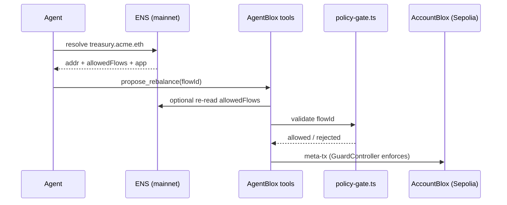

# ENS Integration

**Audience:** Operators linking human-readable treasury identity and policy metadata; developers wiring agent discovery and future MCP export.  
**Prerequisites:** AccountBlox clone address — [provisioning-checklist.md](../provisioning-checklist.md).  
**See also:** [treasury-lifecycle.md](../treasury-lifecycle.md) · [governance.md](../governance.md) · [integrations/README.md](./README.md) · [event/ethglobal-2026.md](../event/ethglobal-2026.md)

**ENS does not enforce treasury policy.** Bloxchain GuardController does. ENS provides **identity and discoverable metadata** for agents and operators.

ENS is **not** part of bloxchain.app — setup and resolution live in AgentBlox. Primary UX today: Copilot `/ens` tool and Console reference fields.

Layer position (see [integrations/README.md](./README.md)):

```text
┌─────────────────────────────────────┐
│  ENS — who is this treasury?        │
├─────────────────────────────────────┤
│  Bloxchain — what may it do?        │
├─────────────────────────────────────┤
│  Dynamic — who signs?               │
├─────────────────────────────────────┤
│  LI.FI — how does execution run?    │
└─────────────────────────────────────┘
```

Event context: [event/ethglobal-2026.md](../event/ethglobal-2026.md).

---

## Summary

ENS is AgentBlox's **decentralized treasury directory** — a portable handle (`treasury.acme.eth`) that resolves to an AccountBlox address plus **policy hints** (allowed flow IDs, app identifier, schema version). It lets humans and agents refer to the same treasury without a centralized registry or deployment-specific `.env` files.

> **ENS names the actor; Bloxchain limits the actor.** Text records carry allowed flow IDs so agents discover treasuries without centralized registries.

---

## Why ENS (beyond "name instead of hash")

| Approach | Pros | Limits |
|----------|------|--------|
| `.env` `TREASURY_ADDRESS` | Simple; works for single deployment | Not portable; no metadata; useless to external agents |
| On-chain SDK reads | Authoritative whitelist and roles | Requires address first; no flow ID strings or app hint |
| ENS name + text records | Portable bootstrap; public; human-readable; shareable in chat | Not enforced on-chain; trust ENS name owner; must stay in sync with chain |

**When ENS matters most:**

- **External agents** — bootstrap from a name only (future MCP export)
- **Multi-treasury orgs** — `treasury.acme.eth` vs `payroll.acme.eth` point to different clones
- **Cross-app interop** — any client can resolve the same metadata via standard viem/ethers
- **Human + agent shared namespace** — CFO says "check `treasury.acme.eth`"; Copilot runs `/ens`

**Hackathon reality:** A single-tenant demo can run entirely from `.env`. ENS still qualifies for sponsor prizes when resolution and text records are **functional** (live lookup, policy metadata visible, ideally wired into policy gate in Phase 6).

---

## Trust model

| Layer | Role | Authority |
|-------|------|-----------|
| ENS text records | Discovery hints — what flows an agent *should* try | ENS name owner (mutable) |
| `policy-gate.ts` | Off-chain pre-flight before sign | Server config + ENS (Phase 6) |
| GuardController | On-chain whitelist enforcement | AccountBlox clone (authoritative) |

**Rules:**

1. **`bloxchain.allowedFlows` must be a subset of on-chain capability** — ENS is discovery; GuardController is authoritative. See [governance.md](../governance.md).
2. **ENS owner can change text records at any time** — agents should treat records as hints and always hit on-chain checks before execution.
3. **`matchesConfiguredTreasury: false`** — warn the operator; do not silently proceed with mismatched addr + `.env`.
4. **Stale ENS** (flows listed but not whitelisted) — off-chain reject in policy gate; on-chain revert anyway if execution is attempted.

---

## Architecture role

```text
ENS name (treasury.acme.eth)
     ↓ resolve (mainnet)
AccountBlox clone address
     ↓ text records
Policy metadata (version, allowed flows, app)
     ↓ pre-flight (Phase 6+)
policy-gate.ts
     ↓ final authority
GuardController on Sepolia
```



ENS applies to **all** treasuries and operation types — not only timelock payments.

### Chain note

`.eth` resolution uses the **Ethereum mainnet** resolver even when the treasury clone lives on Sepolia. Configure `MAINNET_RPC_URL` in `.env`. Set the **ETH address** record to your Sepolia clone address on the mainnet ENS manager ([app.ens.domains](https://app.ens.domains)).

---

## Text record schema

### Current keys (v1)

| Key | Example | Purpose |
|-----|---------|---------|
| `bloxchain.policyVersion` | `1.0.0` | Policy schema version (semver) |
| `bloxchain.allowedFlows` | `rebalance-sepolia-v1` | Comma-separated allowed LI.FI flow IDs |
| `bloxchain.app` | `agentblox` | Managing application / MCP provider |
| `description` | `Acme Corp treasury` | Standard ENS key |
| `url` | Dashboard link | Optional |

Constants in `src/lib/config.ts` as `ENS_TEXT_KEYS`.

**Format rules:**

- `bloxchain.allowedFlows` — comma-separated, no spaces (e.g. `rebalance-sepolia-v1,vendor-pay-sepolia-v1`)
- `bloxchain.policyVersion` — semver; bump when schema or on-chain policy model changes
- `bloxchain.app` — lowercase identifier for the tool server (e.g. `agentblox`)

### Version bump guidance

| Bump | When |
|------|------|
| Patch | Description / URL only |
| Minor | New flow ID added (update on-chain whitelist first, then ENS) |
| Major | Role model change or new required text keys |

When on-chain policy changes, update ENS records to match — see [governance.md](../governance.md) § ENS policy metadata.

### Proposed keys (not implemented)

| Key | Example | Purpose |
|-----|---------|---------|
| `bloxchain.chain` | `sepolia` | Chain where clone is deployed |
| `bloxchain.treasuryType` | `operating` \| `payroll` \| `agent` | Clone purpose in multi-treasury orgs |
| `bloxchain.mcp` | `https://…/mcp` | MCP tool server URL for external agents |
| `bloxchain.sdkVersion` | `1.0.0` | `@bloxchain/sdk` compatibility hint |

---

## Implementation status

| Capability | Status | Location |
|------------|--------|----------|
| Forward resolve + text records | ✅ Done | `resolve_ens_treasury` in `server/tools/read.ts` |
| Match check vs `.env` | ✅ Done | `matchesConfiguredTreasury` |
| Client read helpers | ✅ Done | `src/lib/ens.ts` |
| Console display fields | ⚠️ Partial | `src/pages/ConsolePage.tsx` |
| Policy gate reads ENS | ❌ Phase 6 | `server/policy-gate.ts` |
| Write `setAddr` / `setText` | ❌ Phase 6 | `src/lib/ens.ts` |
| Console link wizard + persistence | ❌ Phase 6 | `src/pages/ConsolePage.tsx` |
| MCP bootstrap export | ❌ Future | `server/mcp/` — see [agent-bridge.md](../agent-bridge.md) |
| Multi-treasury ENS picker | ❌ Future | — |

Track live progress: [implementation-status.md](../implementation-status.md) · [implementation-plan.md](../implementation-plan.md) Phase 6.

---

## Reading ENS (implemented)

### Server tool

`resolve_ens_treasury` in `server/tools/read.ts`:

- Forward resolution via mainnet viem client
- Reads `bloxchain.*` text records
- Compares to `TREASURY_ADDRESS` → `matchesConfiguredTreasury`

### Example output

```json
{
  "name": "treasury.acme.eth",
  "normalized": "treasury.acme.eth",
  "address": "0x783eb64d7d5de55f6913f9cb42ef5a4c402884c0",
  "textRecords": {
    "policyVersion": "1.0.0",
    "allowedFlows": "rebalance-sepolia-v1",
    "app": "agentblox"
  },
  "matchesConfiguredTreasury": true
}
```

### Client helpers

`src/lib/ens.ts` — `resolveEnsToAddress`, `readTreasuryEnsRecords`

---

## Policy gate integration (Phase 6)

Planned behavior for `validateFlowId` in `server/policy-gate.ts`:

```text
1. If ENS_NAME configured → fetch bloxchain.allowedFlows from ENS
2. If ENS returns flows → flowId must appear in ENS list
3. Always → flowId must appear in AGENT_POLICY.allowedFlowIds (server floor)
4. On execute → GuardController is final authority
```

Server allowlist is a **floor** (defense in depth). ENS can advertise a **stricter subset** for discoverability. Optional cross-check also noted in [integrations/lifi.md](./lifi.md).

---

## Agent and Copilot flows

### Copilot today

| Entry | Tool | Behavior |
|-------|------|----------|
| `/ens` | `resolve_ens_treasury` | Resolve name + text records + match check |
| Natural language | same | e.g. "What is our treasury ENS?" |

### Phase 6 — in-app policy path

```text
/ens  →  confirm allowedFlows
/rebalance  →  policy gate reads ENS  →  AGENT_POLICY sign  →  Broadcaster execute
```

Strong demo: reject a `flowId` not listed in `bloxchain.allowedFlows` **before** signing.

### Future — external agent bootstrap

From [agent-bridge.md](../agent-bridge.md) and [treasury-tools.md](../treasury-tools.md):

1. Agent receives only `treasury.acme.eth` (no AgentBlox `.env`)
2. Call `resolve_ens_treasury` (exported as MCP tool)
3. If `bloxchain.app` = `agentblox` → connect to AgentBlox MCP server
4. Operate only within `bloxchain.allowedFlows`
5. On-chain GuardController remains final gate

No AgentBlox-hosted treasury registry DB — ENS is the public index.

---

## Subnames and multi-treasury

| Name | Purpose | Clone |
|------|---------|-------|
| `treasury.acme.eth` | Main operating treasury | AccountBlox clone A |
| `payroll.acme.eth` | Disbursement-focused | Clone B |
| `agent.acme.eth` | Agent identity metadata | Clone A or C |

Each subname can point to the same or different AccountBlox clones. See [extending-use-cases.md](../extending-use-cases.md) § Multi-treasury organizations.

**Hackathon MVP:** one primary name is sufficient — cut subnames first if behind schedule.

**Future:** multi-tenant registry in AgentBlox (treasury picker by ENS) is not yet built.

---

## Writing ENS records (Phase 6)

**Prerequisite:** Dynamic embedded wallet (Owner) must own the ENS name on mainnet.

### Manual setup ([app.ens.domains](https://app.ens.domains))

1. Register or create a subname under your `.eth` name
2. **Records → ETH address** → set to Sepolia AccountBlox clone address
3. **Records → Text** → add `bloxchain.policyVersion`, `bloxchain.allowedFlows`, `bloxchain.app`
4. Optional: `description`, `url`
5. Set `.env`: `ENS_NAME`, `TREASURY_ADDRESS`, `MAINNET_RPC_URL`
6. Copilot `/ens` → expect `matchesConfiguredTreasury: true`

### Programmatic (planned)

```typescript
await resolver.write.setAddr([namehash(normalize(name)), treasuryAddress]);
await resolver.write.setText([node, 'bloxchain.allowedFlows', 'rebalance-sepolia-v1']);
await resolver.write.setText([node, 'bloxchain.policyVersion', '1.0.0']);
await resolver.write.setText([node, 'bloxchain.app', 'agentblox']);
```

Implement write helpers in `src/lib/ens.ts` or a Console wizard. After on-chain whitelist changes via [governance.md](../governance.md), sync ENS text records.

---

## UI flows

### Console (`/console`)

- Display fields for treasury address + ENS name (reference)
- Phase 6: persist to localStorage; "Link ENS" button calling write helpers

### Copilot

- `/ens` — resolve + text records + match check
- Natural language: "What is our treasury ENS?"

---

## Environment

```env
ENS_NAME=treasury.acme.eth
VITE_ENS_NAME=treasury.acme.eth
MAINNET_RPC_URL=https://…
TREASURY_ADDRESS=0x…
```

See [env-configuration.md](../env-configuration.md).

---

## Setup checklist

### Hackathon minimum (Part C)

- [ ] Register ENS name or subname
- [ ] Set ETH address record → Sepolia clone
- [ ] Set `bloxchain.*` text records
- [ ] Configure `.env` and verify Copilot `/ens`
- [ ] Rehearse ENS booth flow — [demo-script.md](../demo-script.md)

Part of [provisioning-checklist.md](../provisioning-checklist.md) Part C.

### Full vision

- [ ] Policy gate cross-checks `bloxchain.allowedFlows` (Phase 6)
- [ ] Console write wizard (Phase 6)
- [ ] Governance sync documented when whitelist changes
- [ ] MCP export of `resolve_ens_treasury` (post-hackathon)
- [ ] Multi-treasury ENS picker (future)

---

## Demo and prizes

| Demo beat | Action |
|-----------|--------|
| Identity | `/ens` — live resolve + text records |
| Functional metadata | Show `allowedFlows` and `policyVersion` in tool card |
| Strong (Phase 6) | `/rebalance` rejects flow not in ENS |
| Booth (Sunday AM) | Required for ENS prizes — [event/ethglobal-2026.md](../event/ethglobal-2026.md) |

Rehearsal script: [demo-script.md](../demo-script.md).

---

## Roadmap

| Phase | Scope | Target |
|-------|-------|--------|
| **6 — Hackathon** | Read ✅; write helpers; policy gate ENS cross-check; Console persistence | [implementation-plan.md](../implementation-plan.md) |
| **Post-hackathon** | MCP export; `bloxchain.mcp` text record; agent bootstrap docs | [agent-bridge.md](../agent-bridge.md) |
| **Long-term** | Multi-treasury ENS picker; reverse resolution (addr → name); ENSIP proposal for `bloxchain.*` schema | — |

Extension recipe step 6 (optional ENS): [extending-use-cases.md](../extending-use-cases.md).

---

## Do not

- Hard-code fake resolution without on-chain lookup
- Put ENS setup in bloxchain.app
- Use ENS only as decoration — must affect `/ens` tool and (Phase 6+) policy metadata
- Treat ENS text records as authoritative policy — GuardController decides execution

---

## Official documentation

- ENS integrating guide: https://ensdomains-ens-contracts.mintlify.app/guides/integrating-ens
- viem `getEnsAddress`: https://viem.sh/docs/ens/actions/getEnsAddress
- viem `getEnsText`: https://viem.sh/docs/ens/actions/getEnsText

---

## Code references

| File | Status |
|------|--------|
| `server/tools/read.ts` | ✅ `resolveEnsTreasury` |
| `server/tools/index.ts` | ✅ tool definition |
| `src/lib/ens.ts` | ✅ read helpers; write helpers Phase 6 |
| `src/lib/config.ts` | ✅ `ENS_TEXT_KEYS` |
| `src/pages/ConsolePage.tsx` | ⚠️ display only |
| `server/policy-gate.ts` | ❌ ENS cross-check Phase 6 |
| `src/hooks/useEnsTreasury.ts` | ❌ planned Phase 6 |
