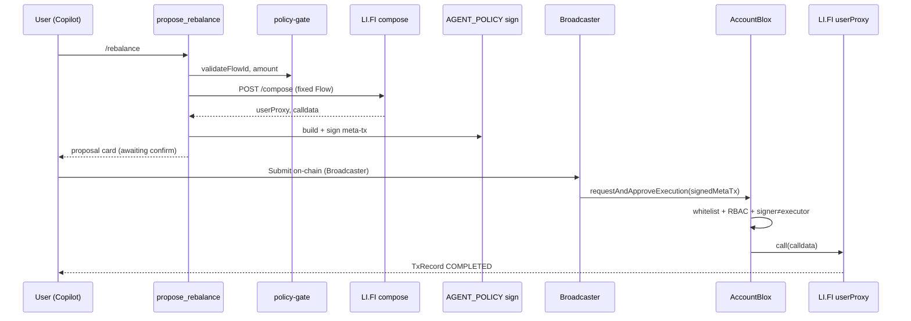
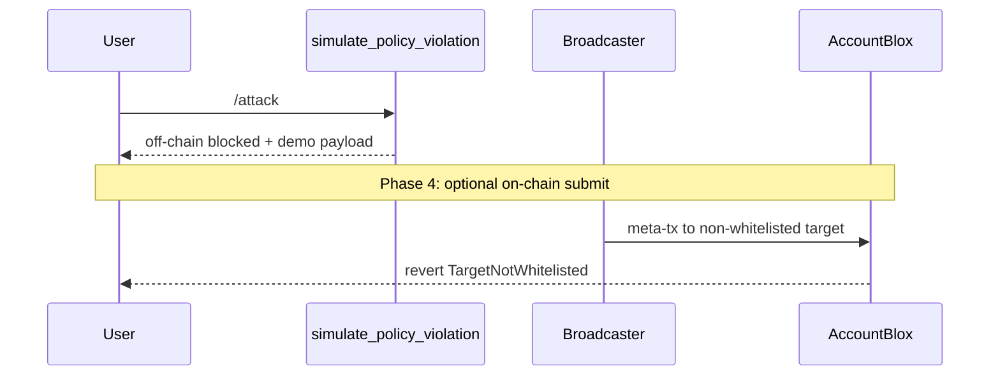
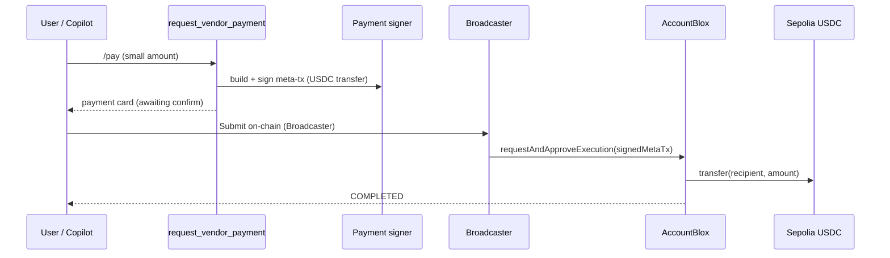
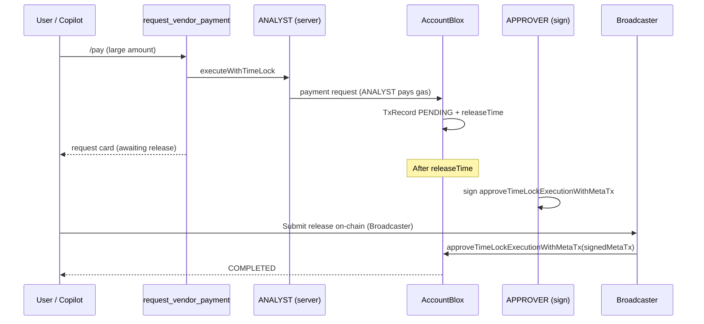

# On-Chain Execution Flow

End-to-end path from **Copilot tool** to **Sepolia transaction**. Canonical execution model after the Copilot pivot.

See also: [treasury-lifecycle.md](./treasury-lifecycle.md) · [treasury-tools.md](./treasury-tools.md) · [guard-controller.md](./guard-controller.md)

---

## Authorization paths

Same treasury, same TxRecord model — two paths:

| Path | Best for | Key methods |
|------|----------|-------------|
| **Policy execution (Lane A — future)** | Agent-proposed ops (e.g. LI.FI rebalance) | AGENT_POLICY sign → `requestAndApproveExecution` |
| **Timelock (Lane B — large / demo default)** | Human-gated disbursements | ANALYST `executeWithTimeLock` → APPROVER sign → Broadcaster approve |
| **Instant payment (Lane B — small)** | Sub-threshold USDC payouts (&lt; $10) | APPROVER sign → `requestAndApproveExecution` → Broadcaster execute |

---

## Three policy layers

| Layer | Where | What it checks |
|-------|-------|----------------|
| **Off-chain** | `server/policy-gate.ts` | Flow ID allowlist, amount > 0, treasury configured |
| **ENS (optional)** | `bloxchain.allowedFlows` text record | Discoverable policy metadata |
| **On-chain** | GuardController + EngineBlox | Whitelist, RBAC, signer ≠ executor, timelock |

On-chain enforcement is authoritative. Off-chain and ENS layers should align for production.

---

## Treasury operation: Rebalance (policy execution — *future / LI.FI*)



### Implementation touchpoints

| Step | File | Status |
|------|------|--------|
| Tool entry | `server/tools/propose.ts` → `proposeRebalance` | ✅ |
| Policy | `server/policy-gate.ts` | ✅ |
| LI.FI compose | `server/lifi/compose.ts` | Future — scaffold exists; needs API key |
| Sign | `server/signing/meta-tx.ts` | ✅ |
| Serialize | `server/signing/serialize.ts` | ✅ |
| Execute | `server/execution/rebalance.ts` + `server/dynamic/broadcaster.ts` | ✅ (env-dependent) |
| Confirm API | `POST /api/execute/rebalance` in `server/index.ts` | ✅ |
| UI confirm | `RebalanceProposalCard` + `BroadcasterSubmitBlock` → `POST /api/execute/rebalance` | ✅ |

Until Phase 4, signing uses `REBALANCE_EXECUTION_TARGET`, `REBALANCE_EXECUTION_SELECTOR` (or `LIFI_EXECUTION_SELECTOR`), and `REBALANCE_EXECUTION_PARAMS` from `.env`.

### Bloxchain method

```typescript
guardController.requestAndApproveExecution(signedMetaTx, { from: broadcasterAddress });
```

---

## Policy validation: Blocked target



Off-chain tool returns `status: blocked`. Phase 4 adds optional Broadcaster submit for on-chain revert proof.

---

## Controlled disbursement: Vendor payment — Lane B (dual path)

USDC `transfer(address,uint256)` on Sepolia USDC uses **two whitelisted paths**. Provision **both** on-chain. AgentBlox routes by amount in `server/policy-gate.ts` (`resolvePaymentPath`): **&lt; $10 USDC → B-fast**, **≥ $10 USDC → B-timelock** (slash: `/pay 5$`, `/pay 20$`).

### Path B-fast — instant (signer + Broadcaster, no ANALYST gas)



**Gas:** Broadcaster pays submission gas only. Signer does not send an on-chain request tx.

**RBAC:** `SIGN_META_REQUEST_AND_APPROVE` + `EXECUTE_META_REQUEST_AND_APPROVE` on ERC20 transfer selector (`0xa9059cbb`).

### Path B-timelock — delayed (ANALYST pays request gas)



**Gas:** ANALYST wallet must hold Sepolia ETH for the timelock **request** transaction.

**RBAC:** ANALYST `EXECUTE_TIME_DELAY_REQUEST`; APPROVER `SIGN_META_APPROVE`; Broadcaster `EXECUTE_META_APPROVE`.

### Off-chain routing (implemented)

`server/policy-gate.ts` → `resolvePaymentPath(amountUsdc)`:

- **B-fast:** amount &lt; `PAYMENT_INSTANT_MAX_USDC` (default **10 USDC**, `10_000_000` units, 6 decimals)
- **B-timelock:** amount ≥ threshold → ANALYST `executeWithTimeLock` on propose

### UI broadcast button

When a signed meta-tx is ready (or a timelock TxRecord is releasable), tool cards show **Submit on-chain (Broadcaster)**. The button calls AgentBlox execute APIs; the **Dynamic server wallet** submits the transaction (user never holds Broadcaster keys).

| Path | Card | API | Broadcaster method |
|------|------|-----|-------------------|
| Rebalance | `RebalanceProposalCard` | `POST /api/execute/rebalance` | `requestAndApproveExecution` |
| B-fast payment | `PaymentRequestCard` | `POST /api/execute/payment` | `requestAndApproveExecution` |
| B-timelock release | `PaymentRequestCard` or Approvals sidebar | `POST /api/execute/payment-approve` | `approveTimeLockExecutionWithMetaTx` |

The button is **disabled** when `/api/health` reports Broadcaster not configured or `matchesOnChainBroadcaster: false`. See [integrations/dynamic.md](./integrations/dynamic.md).

### Bloxchain methods

```typescript
// B-fast (immediate)
guardController.requestAndApproveExecution(signedMetaTx, { from: broadcasterAddress });

// B-timelock — request (ANALYST direct call, pays gas)
guardController.executeWithTimeLock(target, value, selector, params, gasLimit, operationType);

// B-timelock — approve (APPROVER sign + Broadcaster submit)
guardController.approveTimeLockExecutionWithMetaTx(signedMetaTx, { from: broadcasterAddress });
```

**Legacy fallback:** Owner may call `approveTimeLockExecution(txId)` via Dynamic — not the primary demo path.

**Whitelist required:** Sepolia USDC + `transfer(address,uint256)` selector. See [guard-controller.md](./guard-controller.md).

---

## TxRecord lifecycle

Poll after any execution:

```typescript
const record = await guardController.getTransaction(txId);
```

| Status | Meaning | User action |
|--------|---------|-------------|
| `PENDING` | Awaiting timelock release or approval | APPROVER sign + Broadcaster confirm when ready |
| `EXECUTING` | On-chain in progress | Wait |
| `COMPLETED` | Success | Audit |
| `FAILED` | Reverted | Inspect |
| `CANCELLED` | Cancelled | — |

Fields: `releaseTime` (timelock countdown), `params.target` (whitelisted contract), `requester` (audit).

---

## Read path (no execution)

| Tool | Server implementation |
|------|------------------------|
| `get_treasury_status` | viem `getBalance` + `server/bloxchain.ts` role reads |
| `resolve_ens_treasury` | viem ENS on mainnet |
| `list_pending_approvals` | `@bloxchain/sdk` via `server/bloxchain.ts` |
| `get_whitelisted_targets` | `@bloxchain/sdk` `getFunctionWhitelistTargets` |

---

## What not to do

- Execute LI.FI `executeRoute` directly from browser wallet (bypasses GuardController)
- Let LLM call Broadcaster or hold `AGENT_POLICY_PRIVATE_KEY`
- Use legacy `POST /api/agent/rebalance` — use tools via `/api/chat`

See [agent-bridge.md](./agent-bridge.md) for migration note.
