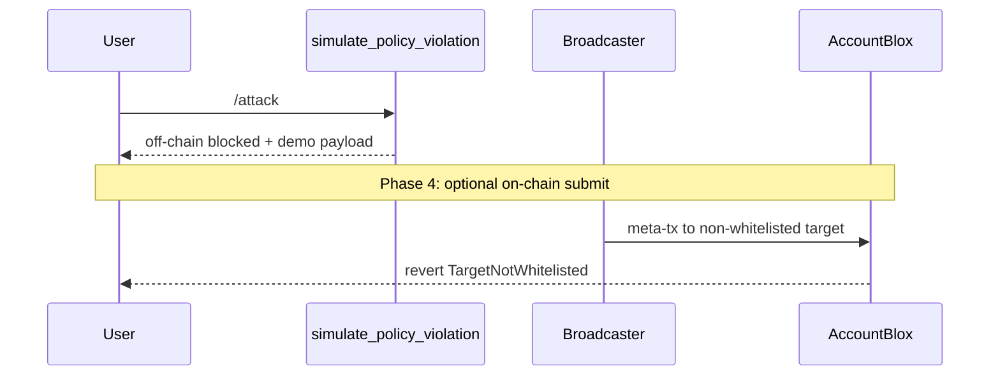
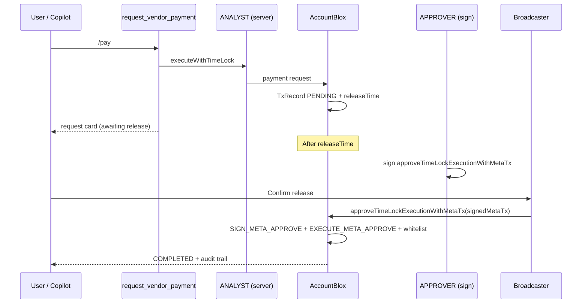

# On-Chain Execution Flow

End-to-end path from **Copilot tool** to **Sepolia transaction**. Canonical execution model after the Copilot pivot.

See also: [treasury-lifecycle.md](./treasury-lifecycle.md) · [treasury-tools.md](./treasury-tools.md) · [guard-controller.md](./guard-controller.md)

---

## Authorization paths

Same treasury, same TxRecord model — two paths:

| Path | Best for | Key methods |
|------|----------|-------------|
| **Policy execution (Lane A — future)** | Agent-proposed ops (e.g. LI.FI rebalance) | AGENT_POLICY sign → `requestAndApproveExecution` |
| **Timelock (Lane B — MVP)** | Human-gated disbursements | ANALYST request → APPROVER sign → Broadcaster `approveTimeLockExecutionWithMetaTx` |

---

## Three policy layers

| Layer | Where | What it checks |
|-------|-------|----------------|
| **Off-chain** | `server/policy-gate.ts` | Flow ID allowlist, amount > 0, treasury configured |
| **ENS (optional)** | `bloxchain.allowedFlows` text record | Discoverable policy metadata |
| **On-chain** | GuardController + EngineBlox | Whitelist, RBAC, signer ≠ executor, timelock |

On-chain enforcement is authoritative. Off-chain and ENS layers should align for production.

---

## Treasury operation: Rebalance (policy execution — *future / LI.FI*)


### Implementation touchpoints

| Step | File | Status |
|------|------|--------|
| Tool entry | `server/tools/propose.ts` → `proposeRebalance` | ✅ |
| Policy | `server/policy-gate.ts` | ✅ |
| LI.FI compose | `server/lifi/compose.ts` | Future — scaffold exists; needs API key |
| Sign | `server/signing/meta-tx.ts` | ✅ |
| Serialize | `server/signing/serialize.ts` | ✅ |
| Execute | `server/execution/rebalance.ts` + `server/dynamic/broadcaster.ts` | ✅ (env-dependent) |
| Confirm API | `POST /api/execute/rebalance` in `server/index.ts` | ✅ |
| UI confirm | `src/components/chat/ToolResultCard.tsx` + `src/lib/execute-api.ts` | ✅ (basic; typed card UI-3 deferred) |

Until Phase 4, signing uses `REBALANCE_EXECUTION_TARGET`, `REBALANCE_EXECUTION_SELECTOR` (or `LIFI_EXECUTION_SELECTOR`), and `REBALANCE_EXECUTION_PARAMS` from `.env`.

### Bloxchain method

```typescript
guardController.requestAndApproveExecution(signedMetaTx, { from: broadcasterAddress });
```

---

## Policy validation: Blocked target



Off-chain tool returns `status: blocked`. Phase 4 adds optional Broadcaster submit for on-chain revert proof.

---

## Controlled disbursement: Vendor payment — Lane B (timelock)



**Role separation:** ANALYST initiates; APPROVER signs; Broadcaster executes — same signer ≠ executor pattern as Lane A.

### Bloxchain methods

```typescript
// Request (ANALYST — direct call)
guardController.executeWithTimeLock(target, value, selector, params, gasLimit, operationType);

// Approve (APPROVER sign + Broadcaster submit)
guardController.approveTimeLockExecutionWithMetaTx(signedMetaTx, { from: broadcasterAddress });
```

**Legacy fallback:** Owner may still call `approveTimeLockExecution(txId)` directly via Dynamic embedded wallet (`src/lib/owner-guard.ts`) — not the hackathon demo path.

**On-chain RBAC:**

| Role | Permission | Selector |
|------|------------|----------|
| ANALYST | `EXECUTE_TIME_DELAY_REQUEST` | USDC `transfer(address,uint256)` |
| APPROVER | `SIGN_META_APPROVE` | Same payment selector |
| Broadcaster | `EXECUTE_META_APPROVE` | `approveTimeLockExecutionWithMetaTx` handler (default schema) |

**Whitelist required:** Sepolia USDC contract + `transfer(address,uint256)` selector (and attached-payment keys if applicable). See [guard-controller.md](./guard-controller.md) § Timelock disbursement.

---

## TxRecord lifecycle

Poll after any execution:

```typescript
const record = await guardController.getTransaction(txId);
```

| Status | Meaning | User action |
|--------|---------|-------------|
| `PENDING` | Awaiting timelock release or approval | APPROVER sign + Broadcaster confirm when ready |
| `EXECUTING` | On-chain in progress | Wait |
| `COMPLETED` | Success | Audit |
| `FAILED` | Reverted | Inspect |
| `CANCELLED` | Cancelled | — |

Fields: `releaseTime` (timelock countdown), `params.target` (whitelisted contract), `requester` (audit).

---

## Read path (no execution)

| Tool | Server implementation |
|------|------------------------|
| `get_treasury_status` | viem `getBalance` + `server/bloxchain.ts` role reads |
| `resolve_ens_treasury` | viem ENS on mainnet |
| `list_pending_approvals` | `@bloxchain/sdk` via `server/bloxchain.ts` |
| `get_whitelisted_targets` | `@bloxchain/sdk` `getFunctionWhitelistTargets` |

---

## What not to do

- Execute LI.FI `executeRoute` directly from browser wallet (bypasses GuardController)
- Let LLM call Broadcaster or hold `AGENT_POLICY_PRIVATE_KEY`
- Use legacy `POST /api/agent/rebalance` — use tools via `/api/chat`

See [agent-bridge.md](./agent-bridge.md) for migration note.
