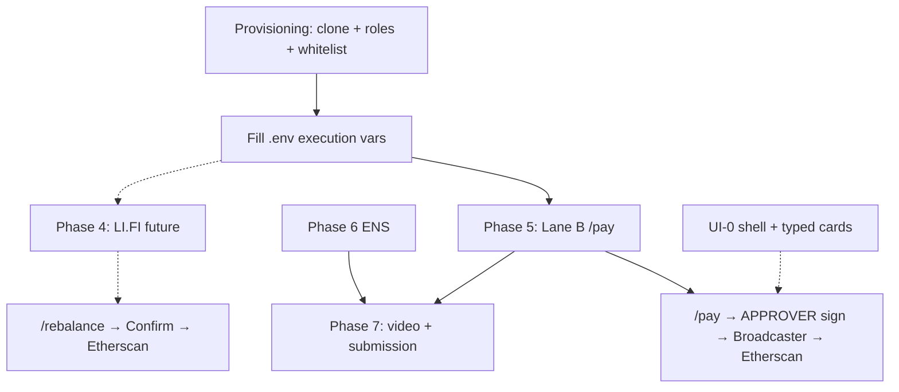

# AgentBlox Overview

**Last updated:** June 2026  
**Audience:** Team members, judges, and contributors who need a fast picture of the project — what it is, where we are, and what comes next.

For setup → [getting-started.md](./getting-started.md)  
For strategy and milestones → [ROADMAP-PLAN.md](./ROADMAP-PLAN.md)  
For live build matrix → [implementation-status.md](./implementation-status.md)  
For task checklist → [implementation-plan.md](./implementation-plan.md)

---

## What AgentBlox is

AgentBlox is Particle CS’s **treasury operations platform** for [ETHGlobal New York 2026](https://ethglobal.com/events/newyork2026). It operates **AccountBlox clones** on Sepolia using the [Bloxchain Protocol](https://github.com/PracticalParticle/Bloxchain-Protocol) — without modifying on-chain core contracts.

| Layer | Sponsor / system | Role |
|-------|------------------|------|
| Identity | ENS | Names treasuries; optional `bloxchain.*` policy text records |
| Authorization | Bloxchain GuardController | Whitelist, RBAC, TxRecord audit, signer ≠ executor |
| Custody | Dynamic | Owner (embedded wallet) + Broadcaster (server wallet) |
| Execution | LI.FI Composer *(future)* | Atomic rebalance flows via whitelisted proxy calls |
| Lane B (MVP) | Bloxchain timelock + Dynamic | Dual path: B-fast (signer+BC) or B-timelock (ANALYST gas) |

**One line (hackathon MVP):** *Dynamic holds the keys. ENS names the actors. Bloxchain decides what anyone is allowed to trigger.*

**One line (with LI.FI — future):** *Dynamic holds the keys. LI.FI runs the flows. ENS names the actors. Bloxchain decides what anyone is allowed to trigger.*

**Product surfaces today:** Copilot chat at `/` with slash commands; Console checklist at `/console`. Target UX is a three-column **Workspace** — see [ui-ux-guidelines.md](./ui-ux-guidelines.md).

---

## Build snapshot (~50% complete)

```text
Phase 0  Scaffold + Copilot + Console     ✅ Done
Phase 1  Bloxchain SDK reads             ✅ Done
Phase 2  Dynamic Broadcaster             ⚠️  Scaffold done — env pending
Phase 3  Meta-tx sign + Confirm          ✅ Done
Phase 4  LI.FI compose + whitelist demo  ⏸ Future — not hackathon MVP
Phase 5  Timelock payments (Lane B)      ⚠️ ANALYST ✅; APPROVER + Broadcaster path in progress
Phase 6  ENS write                       ⚠️  Read only
Phase 7  Demo + submission               ❌ Not started
```

### Working now

- Copilot with 8 treasury tools (LLM or slash-command fallback)
- Real Sepolia reads: balance, roles, pending txs, whitelist
- Mainnet ENS resolution
- Off-chain policy gate
- AGENT_POLICY meta-tx signing + `POST /api/execute/rebalance`
- Copilot **Confirm execution** button in tool cards
- Vitest unit tests (`npm run test`)

### Not demo-complete yet

- Lane B `/pay` E2E: APPROVER sign + Broadcaster submit (ANALYST request ✅)
- On-chain `/attack` revert proof
- **LI.FI (future):** on-chain rebalance, real quote preview

---

## Critical path to hackathon demo

Minimum sequence for a judge-ready story:



**Parallel human work:** [provisioning-checklist.md](./provisioning-checklist.md) — must run alongside engineering.

---

## Next steps (ordered)

### 1. Unblock environment (human — highest priority)

Without these, code paths exist but nothing lands on-chain:

| Variable | Why |
|----------|-----|
| `TREASURY_ADDRESS` | Already set if clone exists |
| `VITE_DYNAMIC_ENVIRONMENT_ID` | Owner widget + server Dynamic client |
| `DYNAMIC_API_TOKEN` | Broadcaster authentication |
| `BROADCASTER_WALLET_ADDRESS` | Must match on-chain Broadcaster role |
| `AGENT_POLICY_PRIVATE_KEY` | Lane A rebalance signing *(future with LI.FI)* |
| `ANALYST_PRIVATE_KEY` | Lane B timelock request — must match on-chain ANALYST |
| `APPROVER_PRIVATE_KEY` | Lane B timelock approval sign — must match on-chain APPROVER |
| `LIFI_EXECUTION_SELECTOR` | LI.FI whitelist + signing *(future)* |
| `REBALANCE_EXECUTION_TARGET` | LI.FI userProxy *(future)* |

Verify: `curl http://localhost:3001/api/health` — all `*Configured` flags should be `true`.

### 2. Phase 5 — Lane B timelock payments *(hackathon critical path)*

| Deliverable | Purpose |
|-------------|---------|
| `request_vendor_payment` on-chain | ANALYST → `executeWithTimeLock` ✅ |
| APPROVER sign + Broadcaster submit | `approveTimeLockExecutionWithMetaTx` |
| On-chain APPROVER role | `SIGN_META_APPROVE` on USDC transfer selector |
| UI-5 card | Payment request + countdown + Confirm release |

See [on-chain-execution-flow.md](./on-chain-execution-flow.md) · [guard-controller.md](./guard-controller.md).

### 3. Phase 4 — LI.FI compose *(future implementation)*

| Deliverable | File |
|-------------|------|
| Composer integration | `server/lifi/compose.ts` (scaffold ✅) |
| Wire into propose flow | `server/tools/propose.ts` |
| Real quote tool | `server/tools/read.ts` |

Blocked on `LIFI_API_KEY` + on-chain whitelist. See [integrations/lifi.md](./integrations/lifi.md).

### 4. UI parallel track

| Priority | Phase | Why |
|----------|-------|-----|
| P0 | UI-0 | Workspace shell — judges see control surface, not raw JSON |
| P0 | UI-1 | Typed read cards for `/status`, `/pending`, `/whitelist` |
| P0 | UI-5 | Timelock payment + APPROVER / Broadcaster confirm |
| P2 | UI-4 | LI.FI quote + policy-blocked cards *(future)* |
| P1 | UI-2 | Setup wizard replaces Console checklist |

UI-3 Confirm is **partial** — basic button in `ToolResultCard`; typed `RebalanceProposalCard` deferred.

### 5. Phase 7 — Submission

- Record 3-min demo ([demo-script.md](./demo-script.md))
- Etherscan links in README
- ENS booth rehearsal ([event/ethglobal-2026.md](./event/ethglobal-2026.md))

---

## Gaps and blockers

### Hard blockers (stop E2E demo)

| Blocker | Type | Resolution |
|---------|------|------------|
| Treasury not fully provisioned | Human | bloxchain.app clone + RBAC + whitelist — [provisioning-checklist.md](./provisioning-checklist.md) Part A |
| Dynamic env empty | Config | Dashboard + `VITE_DYNAMIC_ENVIRONMENT_ID`, `DYNAMIC_API_TOKEN`, `BROADCASTER_WALLET_ADDRESS` |
| AGENT_POLICY key mismatch | Config | Private key must match on-chain role assigned at init |
| No LI.FI API key | Config | **Defer Lane A** — demo Lane B; see [integrations/lifi.md](./integrations/lifi.md) |
| APPROVER key mismatch | Config | Private key must match on-chain APPROVER + `SIGN_META_APPROVE` |
| No LI.FI compose | Code | Phase 4 future — manual `REBALANCE_*` env is interim only |
| userProxy not whitelisted | On-chain | Part A4 — wrong proxy = revert even with correct meta-tx |

### Soft gaps (demo works but weaker story)

| Gap | Impact | Mitigation |
|-----|--------|------------|
| No Workspace UI (UI-0) | JSON tool cards look unfinished | Ship shell + 2–3 typed cards minimum |
| ENS name unset | `/ens` less compelling at booth | Register + link name early |
| No on-chain attack revert | `/attack` is off-chain only | Phase 4 optional Broadcaster submit |
| README says Copilot + Console | Naming drift vs docs | Update when UI-0 lands |
| Orphan pages in repo | Confusing for contributors | Delete or fold in UI-0 |
| No LLM key | Natural language disabled | Slash commands sufficient for demo |

### Risks to watch

From [ROADMAP-PLAN.md](./ROADMAP-PLAN.md) §7:

- LI.FI selector / userProxy mismatch → rebalance reverts on-chain
- Dynamic server wallet API friction → test Broadcaster early
- Scope creep on full Workspace → prioritize typed cards over Settings/mobile
- ENS booth without live name → register and rehearse `/ens` now

---

## Hackathon definition of done

| Criterion | Status |
|-----------|--------|
| Treasury provisioned on Sepolia | ⬜ Operator |
| `/pay` → timelock → APPROVER sign → Broadcaster executes | ⚠️ ANALYST ✅; APPROVER path in progress |
| `/attack` → off-chain block + optional on-chain revert | ⚠️ Off-chain only |
| `/rebalance` → signed meta-tx → LI.FI executes on-chain | ⏸ Future (Phase 4) |
| `/ens` resolves treasury + text records | ⚠️ Read works; ENS optional |
| Demo video + submission | ❌ Phase 7 |

---

## Architecture at a glance

**Lane B (hackathon MVP) — two paths:**

```text
B-fast (< $10 USDC, future routing):
  Payment signer → sign USDC transfer meta-tx → Broadcaster requestAndApproveExecution

B-timelock (≥ $10 or demo default today):
  ANALYST → executeWithTimeLock (pays gas) → APPROVER sign → Broadcaster approve meta-tx
```

**Lane A (future — LI.FI):**

```text
User → Copilot → propose_rebalance → sign (AGENT_POLICY) → Confirm
                                    ↓
              Broadcaster → requestAndApproveExecution → LI.FI proxy
```

Details: [architecture.md](./architecture.md) · [on-chain-execution-flow.md](./on-chain-execution-flow.md)

---

## Documentation map

| I want to… | Read |
|------------|------|
| See strategy and milestones | [ROADMAP-PLAN.md](./ROADMAP-PLAN.md) |
| See what's built today | [implementation-status.md](./implementation-status.md) |
| Set up a treasury | [getting-started.md](./getting-started.md) |
| Configure `.env` | [env-configuration.md](./env-configuration.md) |
| Understand tools | [treasury-tools.md](./treasury-tools.md) |
| Wire sponsors | [integrations/README.md](./integrations/README.md) |
| Plan UI work | [ui-ux-guidelines.md](./ui-ux-guidelines.md) |
| Rehearse demo | [demo-script.md](./demo-script.md) |
| Full doc index | [index.md](./index.md) |

---

## Commands

```bash
npm run dev:all          # Vite + server
npm run test             # Vitest
npm run typecheck        # TypeScript
curl localhost:3001/api/health
```
