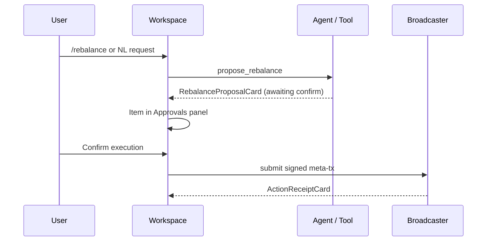
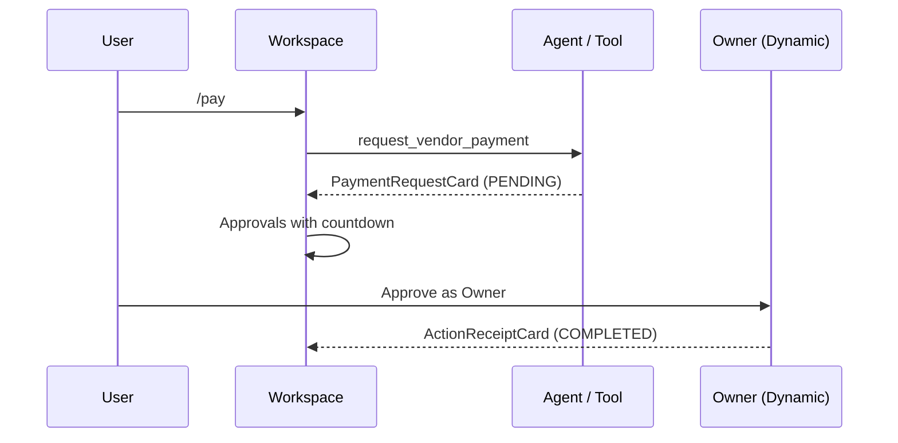

# UI/UX Guidelines

Design specification for the AgentBlox MVP interface — a **treasury control surface** for agentic + human treasury operations on Sepolia.

**Audience:** Designers and frontend engineers building or reviewing AgentBlox UI.  
**See also:** [treasury-tools.md](./treasury-tools.md) · [on-chain-execution-flow.md](./on-chain-execution-flow.md) · [copilot.md](./copilot.md) · [integrations/README.md](./integrations/README.md) · [event/ethglobal-2026.md](./event/ethglobal-2026.md)

---

## Design thesis

AgentBlox is **not** a chatbot with treasury tools. It is a **treasury control surface** where:

1. An **agent** proposes operations via structured tools
2. **Bloxchain policy** constrains what may execute on-chain
3. **Humans** authorize high-stakes actions (Broadcaster confirm, Owner timelock approve)

The product narrative from [event/ethglobal-2026.md](./event/ethglobal-2026.md) must be **visible in the interface**, not only in docs or demo narration:

> Dynamic holds the keys. LI.FI runs the flows. ENS names the actors. Bloxchain decides what anyone is allowed to trigger.

### Why not chat-first?

Industry research on agentic UX converges on the same conclusion: **chat alone fails as the primary workspace** for autonomous or semi-autonomous systems. Users need a control surface — status, approvals, receipts, traces, and recovery — with chat as one input channel.

| Source | Key insight |
|--------|-------------|
| [Smashing Magazine — Agentic UX patterns](https://www.smashingmagazine.com/2026/02/designing-agentic-ai-practical-ux-patterns/) | Six lifecycle patterns: Intent Preview, Autonomy Dial, Explainable Rationale, Confidence Signal, Action Audit, Escalation |
| [Hatchworks — Agent UX patterns](https://hatchworks.com/blog/ai-agents/agent-ux-patterns/) | Taskboard + activity timeline + receipts; chat is secondary |
| [Blake Crosley — Control surface design](https://blakecrosby.com/blog/agentic-design-control-surface) | Product = visible state, permission queues, traces — not the transcript |
| [Clearflow treasury redesign](https://dardesign.io/projects/clearflow-product) | Approvals embedded in workspace; split-view; scannable status; no context switching |

AgentBlox applies these patterns to **policy-gated on-chain treasury ops**, where financial stakes and audit requirements are higher than generic copilots.

---

## MVP goals

| Goal | Definition of done |
|------|-------------------|
| **Out-of-the-box** | First visit → guided setup → first `/status` in under 5 minutes |
| **Integration-legible** | Dynamic, LI.FI, ENS, and Bloxchain each have a visible UI surface |
| **Agent + human** | Agent proposes; human confirms execute-tier actions |
| **Policy-trustworthy** | Blocked states (`/attack`) read as intentional policy enforcement |
| **Demo-ready** | [demo-script.md](./demo-script.md) beats map to UI states without narrator crutches |

### Non-goals (MVP)

- Multi-treasury management
- On-chain governance editing in-app
- MCP server export UI
- Mobile-native layouts
- Fully autonomous execution mode (conflicts with signer ≠ executor model)
- Replacing bloxchain.app for provisioning

---

## UX principles

### 1. Control surface over conversation

The primary workspace shows **what the treasury is**, **what needs approval**, and **what happened** — always visible. Chat is the flexible input at the bottom of the action area, not the whole product.

### 2. Intent before execution

Every propose-tier tool returns an **Intent Preview** before any on-chain transaction. No silent execution. See [on-chain-execution-flow.md](./on-chain-execution-flow.md).

### 3. Policy is a feature, not an error

When `simulate_policy_violation` or the policy gate blocks an action, the UI shows **"Blocked by policy"** with the layer (off-chain / on-chain) and reason — never a generic error that implies the app is broken.

### 4. Separation of duties is visible

Users must always see who **proposes**, who **signs**, and who **executes**:

| Role | Holder | UI label |
|------|--------|----------|
| AGENT_POLICY | Server key | "Agent signs" |
| Broadcaster | Dynamic server wallet | "Broadcaster executes" |
| Owner | Dynamic embedded wallet | "Owner approves" |

### 5. Three policy layers surfaced

| Layer | Where | UI representation |
|-------|-------|-------------------|
| Off-chain | `server/policy-gate.ts` | Policy checklist on proposal cards |
| ENS (optional) | `bloxchain.*` text records | ENS card + allowed flows |
| On-chain | GuardController | Whitelist card, TxRecord status, Etherscan links |

### 6. Approvals live in the workspace

Pending rebalances and timelock payments appear in a persistent **Approvals** panel — not buried behind navigation. Treasury finance UX research shows missed approvals correlate with context switching to separate approval queues.

### 7. Progressive disclosure

- **Read tools** → compact summary cards
- **Propose tools** → expandable detail (calldata, flow ID, targets)
- **Execute** → explicit confirm with consequences stated

---

## Agentic UX patterns (mapped to AgentBlox)

| Pattern | AgentBlox application | Priority |
|---------|----------------------|----------|
| **Intent Preview** | `propose_rebalance`, `request_vendor_payment` cards | P0 |
| **Autonomy Dial** | MVP: fixed at *Plan & Propose* — reads auto, writes always confirm | P2 |
| **Explainable Rationale** | "Why" line on every proposal and block (flow ID, whitelist, gate rule) | P0 |
| **Confidence Signal** | Tool tier badge: Read · Propose · Execute; on-chain vs off-chain scope | P1 |
| **Action Audit & Undo** | Activity timeline with TxRecord status + Etherscan links | P0 |
| **Escalation Pathway** | Missing config → Setup wizard; ambiguous intent → action chips | P0 |

MVP ships at **Level 2 — Guided agent** (Hatchworks): taskboard-like approvals, activity timeline, human checkpoint gates, action receipts. Autonomous mode is out of scope.

---

## Information architecture

### Target model (from scratch)

Replace the mental split of "Copilot vs Console" with **operate vs setup**:

| Surface | Route | Purpose |
|---------|-------|---------|
| **Treasury Workspace** | `/` | Day-to-day operations — status, actions, approvals, activity |
| **Setup Wizard** | `/setup` | First-run and reconfiguration |
| **Settings** | `/settings` | Env checklist, integration health (optional MVP) |

Legacy routes may redirect during migration:

| Legacy route | Redirect |
|--------------|----------|
| `/console` | `/setup` or Settings section |
| `/dashboard` | `/` |
| `/agent` | `/` |
| `/treasury` | `/setup` |

Orphan pages noted in [architecture.md](./architecture.md) (`DashboardPage`, `AgentFlowsPage`, `TreasurySetupPage`) should be **folded into Workspace**, not revived as separate nav items.

### Navigation

```
┌─────────────────────────────────────────────────────────────┐
│ AgentBlox   treasury.acme.eth ▾   [Dynamic: Owner ●]   ⚙  │
├─────────────────────────────────────────────────────────────┤
│  Workspace (default)  ·  Setup  ·  Settings (optional)      │
└─────────────────────────────────────────────────────────────┘
```

---

## Treasury Workspace layout

Primary screen — hybrid **control surface + conversational input**.

```
┌─────────────────────────────────────────────────────────────────────────┐
│ HEADER: brand · ENS name · Dynamic connection · settings                │
├──────────────┬──────────────────────────────────────┬───────────────────┤
│ STATUS RAIL  │ ACTION CENTER                        │ APPROVALS         │
│              │                                      │                   │
│ Balance      │ [Intent Preview / Tool Result Card]  │ ● Rebalance       │
│ ETH + tokens │                                      │   Awaiting confirm│
│              │                                      │   [Confirm][Reject]│
│ Policy       │ ─────────────────────────────────    │                   │
│ ✓ Flow allow │ Copilot thread (compact)             │ ● Vendor payment  │
│ ✓ Whitelist  │                                      │   Timelock 4:32   │
│              │ [Ask or /command...]                   │   [Approve]       │
│ Integrations │ [/status] [/rebalance] [/pay] ...    │                   │
│ ENS    ●     │                                      │ ACTIVITY          │
│ Dynamic●     │                                      │ 10:04 /rebalance  │
│ LI.FI  ●     │                                      │ 10:02 /ens        │
│ Bloxchain●   │                                      │ 09:58 Setup ✓     │
└──────────────┴──────────────────────────────────────┴───────────────────┘
```

### Zone responsibilities

| Zone | Width (desktop) | Purpose | Data sources |
|------|-----------------|---------|--------------|
| **Status rail** | ~240px | Always-on treasury snapshot | `get_treasury_status`, ENS resolve, `GET /api/health` |
| **Action center** | flex | Intent previews, tool results, chat thread | `POST /api/chat`, structured tool payloads |
| **Approvals** | ~320px | Human checkpoint queue | Pending proposals, `list_pending_approvals` |
| **Activity** | bottom of right column | Audit timeline | TxRecord poll, chat action log |

### Responsive behavior (MVP)

| Breakpoint | Layout |
|------------|--------|
| Desktop (≥1024px) | Three columns as above |
| Tablet (768–1023px) | Status rail collapses to top bar; Approvals become slide-over drawer |
| Mobile (&lt;768px) | Single column; tabs: **Act** · **Approve** · **Activity** |

Mobile is P2 for hackathon; design desktop-first for demo.

---

## Setup Wizard

Replace the static [Console](../src/pages/ConsolePage.tsx) checklist with a **guided 4-step flow** and live validation.

### Steps

| Step | Title | User action | Integration | Success signal |
|------|-------|-------------|-------------|----------------|
| 1 | Connect | Sign in with Dynamic | [Dynamic](./integrations/dynamic.md) | Owner wallet connected in header |
| 2 | Import treasury | Paste address **or** resolve ENS name | ENS + Bloxchain | Address resolves; ETH balance readable |
| 3 | Verify policy | Auto-check roles + whitelist | Bloxchain SDK | AGENT_POLICY, Broadcaster, LI.FI proxy present |
| 4 | Ready | Enter Workspace | — | `/status` succeeds; suggested first actions shown |

### Out-of-the-box behavior

- Sepolia network badge always visible
- Link to [bloxchain.app](https://bloxchain.app/) only when step 3 fails (not upfront)
- `OPENAI_API_KEY` optional — toggle "Natural language" in Settings; slash commands always work ([copilot.md](./copilot.md))
- Progress persists in `localStorage`; server reads `TREASURY_ADDRESS` from `.env`
- **Demo mode** (`?demo=1`): read-only pre-provisioned treasury for judges without local `.env`

### Step 3 verification checklist (auto)

| Check | Pass criteria |
|-------|---------------|
| Treasury configured | `TREASURY_ADDRESS` set; `health.treasuryConfigured === true` |
| Owner connected | Dynamic embedded wallet address matches on-chain Owner (optional strict mode) |
| AGENT_POLICY role | Role exists with sign permission on Composer selector |
| LI.FI whitelist | userProxy whitelisted for treasury signer |
| Broadcaster | Server wallet configured (Phase 2+) |

Show ✓ / ⚠ / ✗ per row with link to relevant doc section on failure.

### Empty Workspace gate

If treasury is not configured, `/` redirects to `/setup` with message:

> Connect your treasury to start. Provision an AccountBlox clone on bloxchain.app, then import the address here.

---

## Component system

Replace raw JSON rendering in [ToolResultCard](../src/components/chat/ToolResultCard.tsx) with **typed cards per tool family**. Tool payloads use the `agentblox-tool` fenced block format parsed by [tool-parser.ts](../src/lib/tool-parser.ts).

### Card taxonomy

| Component | Tool(s) | Tier | File (planned) |
|-----------|---------|------|----------------|
| `TreasuryStatusCard` | `get_treasury_status` | Read | `src/components/cards/TreasuryStatusCard.tsx` |
| `EnsTreasuryCard` | `resolve_ens_treasury` | Read | `src/components/cards/EnsTreasuryCard.tsx` |
| `PendingApprovalsCard` | `list_pending_approvals` | Read | `src/components/cards/PendingApprovalsCard.tsx` |
| `WhitelistCard` | `get_whitelisted_targets` | Read | `src/components/cards/WhitelistCard.tsx` |
| `LifiQuoteCard` | `get_lifi_quote_preview` | Read | `src/components/cards/LifiQuoteCard.tsx` |
| `RebalanceProposalCard` | `propose_rebalance` | Propose | `src/components/cards/RebalanceProposalCard.tsx` |
| `PaymentRequestCard` | `request_vendor_payment` | Propose | `src/components/cards/PaymentRequestCard.tsx` |
| `PolicyBlockedCard` | `simulate_policy_violation` | Validate | `src/components/cards/PolicyBlockedCard.tsx` |
| `ActionReceiptCard` | post-execute | Execute | `src/components/cards/ActionReceiptCard.tsx` |

Router: `src/components/cards/ToolCardRouter.tsx` — maps `payload.tool` → component.

### Shared card anatomy

Every card includes:

```
┌─ [Tool display name] ─────────────── [Tier badge] [Status badge] ─┐
│ Primary summary (plain language, one line)                        │
│                                                                   │
│ [Optional: Policy checks | Key fields table | Expandable detail]  │
│                                                                   │
│ [Primary CTA]  [Secondary]  [Link: Etherscan | Docs]              │
└───────────────────────────────────────────────────────────────────┘
```

### Read card specifications

#### `TreasuryStatusCard`

| Field | Display |
|-------|---------|
| Address | Truncated `0x…` with copy |
| ETH balance | Formatted with Sepolia label |
| Configured | Green check or setup CTA |
| Policy summary | Chips: flow allowlist, treasury engine |

#### `EnsTreasuryCard`

| Field | Display |
|-------|---------|
| ENS name | Header with resolve link |
| Resolved address | With match indicator vs `TREASURY_ADDRESS` |
| Text records | Table: `bloxchain.allowedFlows`, other `bloxchain.*` keys |
| Integration badge | ENS ● in status rail updates |

#### `PendingApprovalsCard`

| Field | Display |
|-------|---------|
| List | Scannable rows: type, amount, status, time |
| Empty state | "No pending approvals" |
| Row click | Opens split detail in Action center |

#### `WhitelistCard`

| Field | Display |
|-------|---------|
| Targets | Table: contract label, address, selector |
| Labels | Human names: "LI.FI userProxy", "Sepolia USDC" |
| Count | "N whitelisted targets" |

#### `LifiQuoteCard`

| Field | Display |
|-------|---------|
| Flow ID | `rebalance-sepolia-v1` |
| Route | From → to token, amount |
| Fees / slippage | When available from compose |
| Scope | "Preview only — no execution" |

### Propose card specifications (Intent Preview)

#### `RebalanceProposalCard`

Required sections:

| Section | Content |
|---------|---------|
| **WHAT** | "Swap X ETH → USDC via LI.FI Composer" |
| **WHY** | "Flow `rebalance-sepolia-v1` is allowlisted" |
| **WHO** | Agent signs · Broadcaster executes |
| **RISK** | "On-chain · Irreversible after confirm" |
| **Policy checks** | ✓ Flow ID · ✓ Amount · ✓ Target whitelisted · ✓ Treasury configured |
| **Actions** | `[ Confirm execution ]` `[ Reject ]` `[ Edit amount ]` |

Confirm triggers Broadcaster submit via `POST /api/execute/rebalance`. **Implemented** in `ToolResultCard` when `signedMetaTx` is present; typed `RebalanceProposalCard` is deferred.

#### `PaymentRequestCard`

| Section | Content |
|---------|---------|
| **WHAT** | "Pay {vendor} {amount} {token}" |
| **PATH** | Timelock disbursement |
| **WHO** | Analyst requests · Owner approves after release |
| **Release** | Countdown from `releaseTime` when on-chain |
| **Actions** | `[ Approve as Owner ]` (Dynamic) · `[ Cancel request ]` |

Use **"Approve as Owner"** — not "Confirm" — to distinguish from rebalance path.

### Validate card: `PolicyBlockedCard`

| Field | Display |
|-------|---------|
| Status | **Blocked by policy** (amber/red badge + text) |
| Layer | Off-chain gate / On-chain revert |
| Reason | e.g. `TARGET_NOT_WHITELISTED` |
| Rationale | "This target is not on the GuardController whitelist" |
| Demo link | Etherscan revert tx when Phase 4 complete |
| Tone | Success state for demo — policy worked |

**Never** use generic "Error" or stack traces in user-facing cards.

### Execute card: `ActionReceiptCard`

| Field | Display |
|-------|---------|
| Tx hash | Link to Sepolia Etherscan |
| TxRecord status | `PENDING` → `EXECUTING` → `COMPLETED` / `FAILED` |
| Signer / executor | Addresses with role labels |
| Timestamp | Relative + absolute |
| Audit | "View in Activity" scroll target |

---

## Integration UX

Persistent **integration stack** in the Status rail — maps to [integrations/README.md](./integrations/README.md) layer model:

```
┌─ Integrations ─────────────┐
│ ENS        treasury.acme.eth │
│ Bloxchain  3 flows · 2 pend. │
│ Dynamic    Owner ● Broadcaster ● │
│ LI.FI      Composer ready    │
└──────────────────────────────┘
```

| Integration | UI touchpoints | Health indicator |
|-------------|------------------|------------------|
| **ENS** | Header name, Setup step 2, `EnsTreasuryCard` | ● resolved / ○ not set |
| **Dynamic** | Header widget, payment approve CTA | ● Owner connected / ○ disconnected |
| **LI.FI** | Rebalance + quote cards, flow ID chip | ● whitelisted / ⚠ stub |
| **Bloxchain** | Policy chips, whitelist, TxRecord activity | ● SDK connected / ○ stub |

### Sponsor demo narrative → UI

From [event/ethglobal-2026.md](./event/ethglobal-2026.md):

| Verbal beat | UI equivalent |
|-------------|---------------|
| "ENS names the actor" | ENS name in header + `/ens` card |
| "Bloxchain limits the actor" | Policy checklist + `/attack` blocked card |
| "Dynamic holds the keys" | Dynamic widget + role labels on proposals |
| "LI.FI runs approved flows" | Flow ID + route on rebalance card |

---

## Human-in-the-loop flows

Two authorization paths from [on-chain-execution-flow.md](./on-chain-execution-flow.md) — **different UI treatment required**.

### Path A: Policy execution (`/rebalance`)



**UX copy (confirm dialog):**

> You are authorizing the Broadcaster to submit a signed meta-transaction. The agent proposed and signed this action but cannot execute it alone.

### Path B: Timelock payment (`/pay`)



**UX copy (approve button):**

> Approve as Owner — releases funds after the timelock period.

### Approvals panel rules

| State | Badge | Primary action | Who clicks |
|-------|-------|----------------|------------|
| Rebalance proposed | Awaiting confirm | Confirm execution | Any authorized user |
| Payment pending timelock | Timelock {MM:SS} | Approve as Owner | Dynamic Owner only |
| Payment ready | Ready to approve | Approve as Owner | Dynamic Owner only |
| Blocked | Blocked by policy | — (view only) | — |

---

## Copilot input & commands

Chat remains the flexible input at the bottom of Action center. See [copilot.md](./copilot.md) for server behavior.

### Action chips (always visible)

| Group | Chips | Tool |
|-------|-------|------|
| **Monitor** | Status · ENS · Pending · Whitelist · Quote | read tools |
| **Operate** | Rebalance · Pay | propose tools |
| **Validate** | Attack | `simulate_policy_violation` |
| **Help** | Help | — |

Chips send the slash command equivalent. In fallback mode (no `OPENAI_API_KEY`), chips are the primary discovery path.

### Empty state (Action center)

When treasury is configured and no messages:

> Your treasury is connected. Try **Status** to see balances, or ask *"What's pending approval?"*

With ENS:

> **treasury.acme.eth** is ready. Try **Rebalance** to propose a policy-gated swap.

### Placeholder text

| Mode | Input placeholder |
|------|-------------------|
| LLM enabled | Ask about balances, rebalances, payments, or policy… |
| Fallback | Use /status, /rebalance, /pay, /attack, or /help |

---

## Visual language

Minimal design system for hackathon MVP. Extend via CSS variables in `src/App.css` or a future `src/styles/tokens.css`.

### Status colors

| Token | Use | Never alone |
|-------|-----|-------------|
| `completed` / green | ok, configured, COMPLETED | Always pair with text label |
| `pending` / amber | proposed, PENDING, awaiting | |
| `blocked` / red | policy block, FAILED | Use "Blocked by policy" not just color |
| `neutral` / gray | read-only, informational | |

Maps to existing `statusColor()` in [tool-parser.ts](../src/lib/tool-parser.ts).

### Tier badges

| Badge | Meaning |
|-------|---------|
| **Read** | No chain write |
| **Propose** | Awaiting human decision |
| **Execute** | On-chain action in progress or complete |

### Typography

| Use | Style |
|-----|-------|
| Headings, summaries | Sans-serif, plain language |
| Addresses, tx hashes, calldata | Monospace, truncatable with copy |
| Amounts | Tabular nums, token symbol suffix |

### Density

Finance-grade scannable lists. Avoid chat-bubble clutter for structured tool output — cards are not messages.

---

## Copy deck

Standard strings for consistency across components.

### Buttons

| Action | Label | Never use |
|--------|-------|-----------|
| Submit rebalance | **Confirm execution** | "OK", "Submit", "Go" |
| Reject proposal | **Reject** | "Cancel" (ambiguous) |
| Approve timelock payment | **Approve as Owner** | "Confirm" (conflicts with rebalance) |
| Copy address | **Copy** | — |
| View transaction | **View on Etherscan** | Raw URL |

### Status labels

| Internal status | User-facing label |
|-----------------|-------------------|
| `ok` | Complete |
| `proposed` | Awaiting your confirm |
| `requested` | Pending approval |
| `preview` | Preview only |
| `blocked` | Blocked by policy |
| `rejected` | Rejected |
| `PENDING` (TxRecord) | Pending |
| `COMPLETED` | Completed |
| `FAILED` | Failed on-chain |

### Empty states

| Context | Copy |
|---------|------|
| No messages | Your treasury is connected. Try **Status** to see balances. |
| No pending approvals | No pending approvals. |
| Treasury not configured | Connect your treasury to start. |
| Dynamic not connected | Connect your Owner wallet to approve payments. |
| LLM disabled | Slash commands work without an API key. Add `OPENAI_API_KEY` for natural language. |

### Error / escalation

| Condition | Copy |
|-----------|------|
| Policy gate fail | This action isn't allowed by treasury policy. Reason: {reason}. |
| Missing treasury | Set `TREASURY_ADDRESS` in `.env` or complete Setup. |
| Broadcaster fail | Execution failed. View details or try again. |
| ENS mismatch | Resolved address doesn't match configured treasury. |

---

## Implementation plan

UI phases align with [implementation-plan.md](./implementation-plan.md) backend work. Estimates assume 1 frontend engineer.

| Phase | Focus | Hours | Depends on | Deliverables |
|-------|-------|-------|------------|--------------|
| **UI-0** | Workspace shell | 2–3h | Phase 0 ✅ | Three-column layout, header, status rail skeleton, activity feed |
| **UI-1** | Typed read cards | 2h | Phase 1 reads | `ToolCardRouter` + read card components |
| **UI-2** | Setup wizard | 2h | Dynamic widget | `/setup` 4-step flow, Workspace gate |
| **UI-3** | Intent Preview + Approvals | 3h | Phase 3 ✅ | **Partial** — `ToolResultCard` Confirm; `RebalanceProposalCard` deferred |
| **UI-4** | LI.FI + blocked polish | 2h | Phase 4 | `LifiQuoteCard`, `PolicyBlockedCard`, Etherscan link |
| **UI-5** | Timelock approval | 2h | Phase 5 | `PaymentRequestCard`, Owner approve, countdown |
| **UI-6** | Demo polish | 2h | Phase 7 | Loading states, `?demo=1`, keyboard `/` focus |

**Total:** ~15h (parallelizable with backend phases)

### File tree (target)

```
src/
├── pages/
│   ├── WorkspacePage.tsx          # replaces CopilotPage as /
│   ├── SetupPage.tsx              # replaces ConsolePage
│   └── SettingsPage.tsx           # optional MVP
├── components/
│   ├── workspace/
│   │   ├── StatusRail.tsx
│   │   ├── ActionCenter.tsx
│   │   ├── ApprovalsPanel.tsx
│   │   ├── ActivityFeed.tsx
│   │   └── IntegrationStack.tsx
│   ├── cards/
│   │   ├── ToolCardRouter.tsx
│   │   ├── TreasuryStatusCard.tsx
│   │   ├── EnsTreasuryCard.tsx
│   │   ├── PendingApprovalsCard.tsx
│   │   ├── WhitelistCard.tsx
│   │   ├── LifiQuoteCard.tsx
│   │   ├── RebalanceProposalCard.tsx
│   │   ├── PaymentRequestCard.tsx
│   │   ├── PolicyBlockedCard.tsx
│   │   └── ActionReceiptCard.tsx
│   ├── setup/
│   │   ├── SetupWizard.tsx
│   │   ├── ConnectStep.tsx
│   │   ├── ImportStep.tsx
│   │   ├── VerifyStep.tsx
│   │   └── ReadyStep.tsx
│   └── chat/                      # retained — input + message thread
│       ├── ChatInput.tsx
│       └── ChatMessageView.tsx
└── hooks/
    ├── useServerHealth.ts         # existing
    ├── useTreasuryStatus.ts       # poll status rail
    └── usePendingApprovals.ts     # poll approvals panel
```

### Migration from current UI

| Current | Target |
|---------|--------|
| `CopilotPage.tsx` | `WorkspacePage.tsx` — chat embedded in Action center |
| `ConsolePage.tsx` | `SetupPage.tsx` — wizard replaces static checklist |
| `ToolResultCard.tsx` (JSON) | `ToolCardRouter.tsx` + typed cards |
| `ChatInput.tsx` suggestion chips | Retain; add group labels (Monitor / Operate) |

---

## Screen inventory

| Screen | Route | Priority | Key components |
|--------|-------|----------|----------------|
| Treasury Workspace | `/` | P0 | StatusRail, ActionCenter, ApprovalsPanel, ActivityFeed |
| Setup Wizard | `/setup` | P0 | SetupWizard, ConnectStep, ImportStep, VerifyStep |
| Proposal detail | split in Action center | P1 | RebalanceProposalCard, PaymentRequestCard |
| Settings | `/settings` | P2 | Env checklist (from Console) |
| Demo mode | `/?demo=1` | P2 | Read-only Workspace with sample data |

---

## Anti-patterns

| Anti-pattern | Why it fails for AgentBlox |
|--------------|---------------------------|
| Chat-only interface | Hides approvals, policy layers, audit trail |
| Raw JSON tool output | Destroys trust for finance/treasury users |
| Separate Console for daily ops | Context switching; approvals get missed |
| Generic "AI assistant" branding | Underplays policy-gated treasury positioning |
| Autonomous execution in MVP | Violates signer ≠ executor invariant |
| Same "Confirm" for rebalance and payment | Role confusion (Broadcaster vs Owner) |
| Hiding integration failures | Users blame AgentBlox instead of missing `.env` |
| "Error" for `/attack` demo | Policy block is the success state |

---

## Success metrics

| Metric | Target | How to measure |
|--------|--------|----------------|
| Time to first `/status` | &lt; 5 min (fresh clone) | Setup wizard usability test |
| Four-layer comprehension | User names ENS/Bloxchain/Dynamic/LI.FI without docs | Demo rehearsal |
| Rebalance flow clarity | User reviews Intent Preview before Confirm | Observation |
| `/attack` demo clarity | Reads as "policy worked" | Card copy review |
| Demo without narrator | [demo-script.md](./demo-script.md) beats visible in UI | Run script against UI |
| Intent Preview acceptance | &gt; 85% confirm without edit | Smashing Magazine benchmark |

---

## Accessibility (MVP minimum)

- Status never conveyed by color alone — always include text label
- Focus order: Status rail → Action center → Approvals → input
- Confirm / Approve buttons: min 44px touch target
- Etherscan links: `rel="noreferrer"` + open in new tab with aria-label
- Loading: skeleton placeholders, not spinners alone

---

## Related docs

| Doc | Relationship |
|-----|--------------|
| [treasury-tools.md](./treasury-tools.md) | Tool catalog → card mapping |
| [copilot.md](./copilot.md) | Server chat behavior, slash commands |
| [on-chain-execution-flow.md](./on-chain-execution-flow.md) | HITL sequences → UI flows |
| [implementation-plan.md](./implementation-plan.md) | Backend phases paired with UI phases |
| [implementation-status.md](./implementation-status.md) | Track UI build progress |
| [demo-script.md](./demo-script.md) | Demo beats → UI states |
| [provisioning-checklist.md](./provisioning-checklist.md) | Setup wizard content |
| [integrations/](./integrations/README.md) | Per-sponsor UI requirements |

---

## External references

| Resource | Topic |
|----------|-------|
| [Smashing Magazine — Agentic UX patterns](https://www.smashingmagazine.com/2026/02/designing-agentic-ai-practical-ux-patterns/) | Six core patterns |
| [Hatchworks — Agent UX patterns](https://hatchworks.com/blog/ai-agents/agent-ux-patterns/) | Taskboard, receipts, HITL |
| [Blake Crosley — Control surface design](https://blakecrosley.com/blog/agentic-design-control-surface) | Traces, permission queues |
| [Clearflow treasury redesign](https://dardesign.io/projects/clearflow-product) | Approval inbox in workspace |
| [Vercel AI SDK — Tool usage](https://ai-sdk.dev/docs/ai-sdk-ui/chatbot-tool-usage) | Chat + tool rendering |
